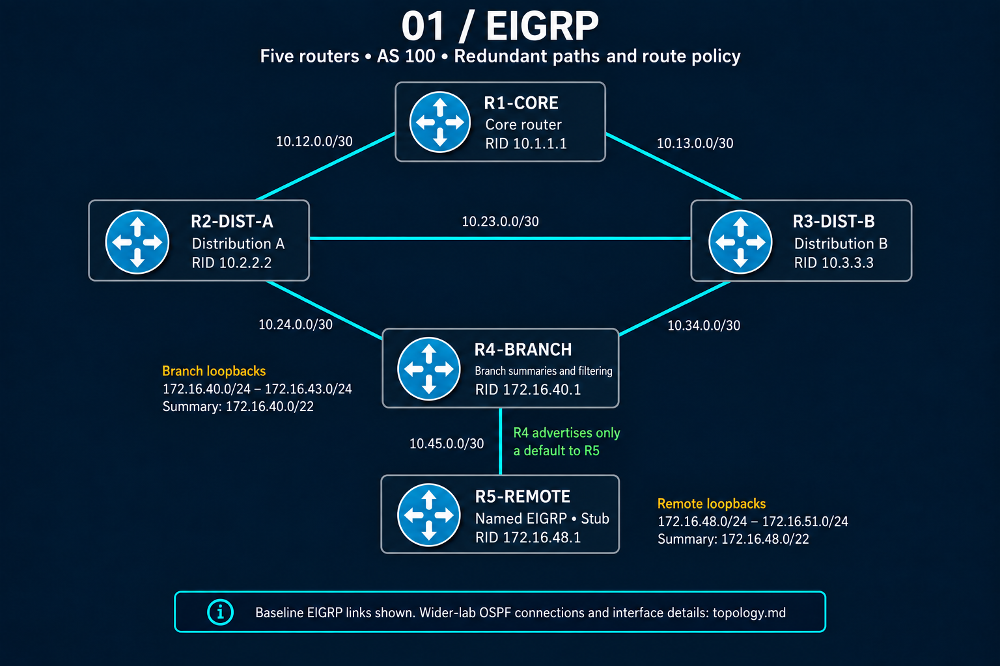

# EIGRP Lab

## Overview

This project documents the Enhanced Interior Gateway Routing Protocol (EIGRP) portion of my CCNP Enterprise lab environment.

The lab was built using Cisco Modeling Labs (CML) to develop practical experience designing, configuring, verifying, and troubleshooting enterprise routing environments.

The focus of this project was understanding EIGRP behavior beyond configuration, including convergence, path selection, failure recovery, and troubleshooting methodology.

---

# Lab Objectives

The goals of this lab were:

- Build an enterprise EIGRP routing domain
- Understand EIGRP neighbor formation
- Analyze Diffusing Update Algorithm (DUAL) behavior
- Validate successor and feasible successor operation
- Test routing convergence during failures
- Implement EIGRP authentication
- Practice summarization and route control techniques

---

# Lab Topology

The EIGRP lab consisted of a multi-router enterprise topology designed to simulate core, distribution, and branch routing relationships.

The topology was used to validate:

- EIGRP neighbor formation
- Route propagation
- Redundant path selection
- Routing convergence during failures
- Dynamic routing troubleshooting

## Topology Diagram




---

# Technologies Practiced

## EIGRP Fundamentals

- Classic EIGRP configuration
- Named EIGRP configuration
- Autonomous System (AS) operation
- Neighbor relationships
- Hello and hold timers
- Routing table verification

## DUAL and Path Selection

- Feasible Distance (FD)
- Reported Distance (RD)
- Successor routes
- Feasible Successor routes
- Feasibility Condition
- Passive and Active states

## Design Features

- EIGRP authentication
- Route summarization
- Stub routing
- Route filtering
- Default route propagation

---

# Skills Demonstrated

- Enterprise routing design
- Dynamic routing troubleshooting
- Network convergence analysis
- Cisco IOS verification methodology
- Failure scenario testing
- Routing protocol optimization
- Network behavior analysis
- Troubleshooting methodology

---

# Troubleshooting Scenarios

This lab included deliberate failure testing to observe EIGRP convergence behavior.

The goal was to understand how EIGRP reacts to network changes and how DUAL determines the best available path.

## Failure Testing Performed

### Successor Failure

Tested primary path failure and observed:

- Successor route removal
- Feasible Successor promotion
- Routing convergence behavior

### Feasible Successor Validation

Analyzed alternate paths by comparing:

- Feasible Distance (FD)
- Reported Distance (RD)
- Feasibility Condition

### Loss of Feasible Successor

Manipulated path characteristics to remove the Feasible Successor condition and observed:

- Route transition into Active state
- Query propagation
- EIGRP convergence process

### Neighbor Troubleshooting

Validated common EIGRP adjacency issues including:

- Authentication mismatches
- Timer mismatches
- Interface participation
- Neighbor state verification

Detailed troubleshooting scenarios will be documented in the troubleshooting directory.

---

# Verification

The following Cisco IOS commands were used to validate EIGRP operation.

## Neighbor Verification

```text
show ip eigrp neighbors
```

Used to verify:

- EIGRP neighbor relationships
- Adjacency status
- Interface participation
- Neighbor uptime


## Topology Verification

```text
show ip eigrp topology
```

Used to verify:

- Successor routes
- Feasible Successor routes
- Feasibility Condition
- Feasible Distance (FD)
- Reported Distance (RD)
- EIGRP metric calculations


## Detailed Topology Verification

```text
show ip eigrp topology all-links
```

Used to verify:

- All available paths
- Successor and non-successor routes
- Alternate paths not installed in the Routing Information Base (RIB)


## Routing Table Verification

```text
show ip route eigrp
```

Used to verify:

- Installed EIGRP routes
- Administrative Distance
- Metric selection
- Active forwarding paths


## Protocol Verification

```text
show ip protocols
```

Used to verify:

- EIGRP Autonomous System (AS) configuration
- Network statements
- Passive interfaces
- Redistribution settings


## Failure Analysis Verification

The following commands were used during failure testing and convergence analysis:

```text
show ip eigrp topology <prefix>
show ip route <prefix>
show logging
```

These commands were used to analyze:

- Successor changes
- Feasible Successor promotion
- Route convergence
- Neighbor events
- EIGRP Active state behavior

---

# Repository Structure

```text
01-EIGRP

├── configs
│   └── Sanitized Cisco IOS configurations

├── verification
│   └── Show command outputs and validation results

└── troubleshooting
    └── Failure scenarios and analysis
```

---

# Lab Environment

Tools used:

- Cisco Modeling Labs (CML)
- Cisco IOSv routers
- GitHub documentation workflow

---

# Lessons Learned

Key takeaways from this lab:

- EIGRP maintains loop-free backup paths through DUAL
- Understanding Feasible Distance (FD) and Reported Distance (RD) is critical for troubleshooting convergence
- Verification commands are essential for validating expected network behavior
- Network failures should be tested intentionally to understand protocol operation
- Troubleshooting routing protocols requires understanding both configuration and protocol decision-making


