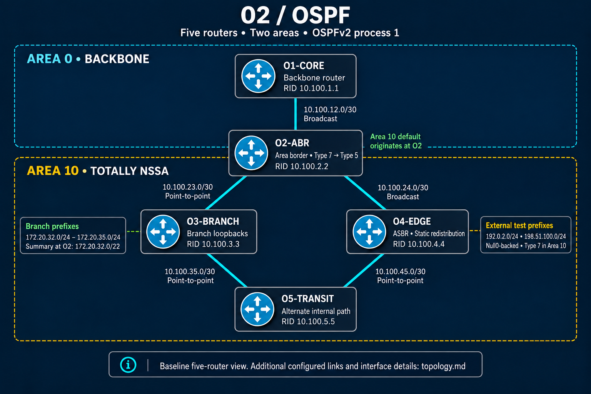

# OSPF Lab Portfolio

## Overview

This section documents a five-router, CCNP-level OSPF lab built to explore how a multi-area link-state routing domain operates, converges, and behaves under failure or policy changes. The topology uses **O1-CORE**, **O2-ABR**, **O3-BRANCH**, **O4-EDGE**, and **O5-TRANSIT** to model core, area-border, branch, edge, and transit responsibilities.

The lab extends beyond basic neighbor formation. It examines OSPF adjacencies, network types, designated-router behavior, the link-state database, inter-area route exchange, stub-area variants, external route handling, route control, and equal-cost path selection. Supporting configurations, healthy-state verification, and focused troubleshooting case studies are organized in dedicated subdirectories.

> **Scope note:** Interface addressing, device-to-interface mappings, and CLI output are documented only in the supporting artifacts captured from the lab. This overview intentionally avoids assumed details.

## Lab Objectives

- Build and validate a five-router OSPF domain using OSPF process 1.
- Establish a multi-area hierarchy containing **Area 0** and **Area 10**.
- Confirm neighbor formation and progress through the expected adjacency states.
- Examine DR/BDR elections on multiaccess segments where applicable.
- Compare OSPF network types and understand how they affect neighbor discovery, elections, timers, and next-hop behavior.
- Interpret the OSPF link-state database and relate LSA types to router roles and routing-table entries.
- Analyze the responsibilities of internal routers, backbone routers, ABRs, and ASBRs.
- Explore NSSA and totally NSSA behavior, including Type 7 external advertisements and Type 7-to-Type 5 translation.
- Apply and verify summarization and route filtering at appropriate OSPF boundaries.
- Validate equal-cost multipath (ECMP) operation when the topology provides equal-cost routes.
- Examine redistribution at controlled routing-domain boundaries without treating redistribution as an unrestricted design shortcut.
- Introduce realistic control-plane faults, identify their root causes, restore the intended state, and document the evidence.

## Topology Summary



The lab is organized as a five-router OSPF domain:

| Router | Functional role in the lab |
|---|---|
| **O1-CORE** | Core/backbone routing function within the OSPF domain |
| **O2-ABR** | Area Border Router connecting the backbone and non-backbone area |
| **O3-BRANCH** | Branch-side OSPF participation in the multi-area design |
| **O4-EDGE** | Edge function used to examine route-policy and external-routing behavior |
| **O5-TRANSIT** | Transit-side routing function associated with the lab boundary |

**Area 0** provides the OSPF backbone, while **Area 10** supplies the non-backbone area used to study inter-area behavior and stub-area variants. The design provides clear observation points for ABR processing, LSA scope, external-route translation, route summarization, filtering, and path selection.

## Technologies and Concepts Practiced

### OSPF Adjacencies and Interface Behavior

- Router IDs and their role in identifying OSPF speakers
- Hello packet exchange and neighbor discovery
- Neighbor state progression from initial discovery to `FULL`
- Adjacency prerequisites, including compatible area and interface parameters
- OSPF interface network types
- DR and BDR election behavior on eligible multiaccess networks
- The relationship between network type, adjacency formation, and topology representation

### Multi-Area OSPF

- Backbone and non-backbone area design
- Internal-router, backbone-router, and ABR responsibilities
- Inter-area reachability through the ABR
- Area boundaries as points for route control and summarization
- The effect of area type on permitted LSAs and routing information

### Link-State Advertisements

The lab develops practical familiarity with the purpose and scope of the following LSAs:

| LSA type | Function examined in the lab |
|---|---|
| **Type 1** | Router topology within an area |
| **Type 2** | Multiaccess network representation by the DR, where applicable |
| **Type 3** | Inter-area summary information originated by an ABR |
| **Type 4** | Reachability to an ASBR across area boundaries |
| **Type 5** | External prefixes advertised through the standard OSPF domain |
| **Type 7** | External prefixes originated inside an NSSA |

Rather than treating the LSDB as an abstract table, the lab connects each relevant LSA to its originator, flooding scope, associated router role, and resulting route-table behavior.

### NSSA and External Routing

- NSSA and totally NSSA concepts
- Restrictions on Type 5 LSAs inside an NSSA
- Type 7 origination for external information within an NSSA
- Type 7-to-Type 5 translation at the appropriate ABR
- ASBR and ABR responsibilities at redistribution and area boundaries
- Verification of external routing behavior from both the LSDB and routing table

### Route Control and Path Selection

- Inter-area summarization
- ABR route filtering and its control-plane effects
- Redistribution boundaries and external-route propagation
- OSPF cost comparison and best-path selection
- ECMP installation when multiple paths have equal OSPF cost

## Skills Demonstrated

- Designing and validating a hierarchical OSPF deployment
- Mapping logical OSPF roles to a five-router enterprise-style topology
- Reading neighbor, interface, protocol, database, and routing-table state as a connected evidence set
- Distinguishing adjacency problems from LSDB, route-policy, and forwarding problems
- Identifying the origin, scope, and purpose of multiple OSPF LSA types
- Explaining ABR and ASBR behavior across area and redistribution boundaries
- Evaluating NSSA translation rather than checking only end-to-end reachability
- Applying summarization and filtering at deliberate control points
- Confirming ECMP from metric and route-installation evidence
- Capturing a known-good baseline before fault injection
- Troubleshooting through hypothesis, evidence, correction, and post-change validation
- Producing sanitized, repeatable technical documentation suitable for a professional portfolio

## Verification Strategy

Verification is performed in layers so that a successful ping is not mistaken for complete protocol health.

1. **Interface and protocol state** — confirm that participating interfaces are operational and that OSPF is enabled with the intended area and network behavior.
2. **Neighbor state** — validate discovered neighbors, adjacency state, peer router IDs, and expected DR/BDR relationships where applicable.
3. **Link-state database** — inspect the LSAs present on representative routers and verify their origin, type, scope, and translation behavior.
4. **Routing information** — confirm intra-area, inter-area, and external routes as appropriate to each router's position in the topology.
5. **Path selection** — compare costs and verify ECMP when equal-cost paths are expected.
6. **Policy behavior** — verify that summarization, filtering, NSSA controls, and redistribution boundaries produce the intended routing view.
7. **End-to-end reachability** — test the data plane only after the expected control-plane state is understood.

Healthy-state evidence belongs in [`verification/`](verification/), allowing troubleshooting results to be compared against a documented baseline.

## Troubleshooting Scenarios

The troubleshooting portion of the portfolio focuses on faults that require protocol-state analysis rather than simple configuration comparison.

### 1. MTU Mismatch During Database Exchange

An interface MTU inconsistency can allow OSPF neighbors to discover one another but prevent the adjacency from completing database synchronization. The scenario examines neighbors stalled in `EXSTART` or `EXCHANGE`, distinguishes the symptom from basic Layer 3 loss, and validates recovery after the inconsistency is corrected.

### 2. NSSA Capability and LSA Translation

This scenario examines a failure or inconsistency involving NSSA behavior and external-route propagation. Diagnosis follows the route from Type 7 origination inside the NSSA through ABR translation into a Type 5 LSA, checking area capability, LSDB evidence, and routing-table outcomes at each stage.

### 3. ABR Route Filtering and Control-Plane Consistency

This scenario evaluates how ABR filtering affects Type 3 inter-area information. It demonstrates that local adjacencies can remain healthy while remote reachability changes because the expected inter-area advertisement is suppressed or inconsistently controlled.

Each completed case study follows the same evidence-based structure:

- Intended behavior and healthy baseline
- Fault introduced
- Observed symptoms
- Investigation and diagnostic evidence
- Root cause
- Corrective action
- Post-restoration verification
- Operational takeaway

Detailed case studies are maintained in [`troubleshooting/`](troubleshooting/).

## Repository Structure

```text
02-OSPF/
├── README.md
├── topology.png
├── configs/
│   ├── README.md
│   ├── O1-CORE.cfg
│   ├── O2-ABR.cfg
│   ├── O3-BRANCH.cfg
│   ├── O4-EDGE.cfg
│   └── O5-TRANSIT.cfg
├── verification/
│   ├── README.md
│   ├── neighbors/
│   ├── interfaces/
│   ├── database/
│   ├── routing/
│   └── protocols/
└── troubleshooting/
    ├── README.md
    ├── scenario-1-ospf-mtu-exstart-exchange.md
    ├── scenario-2-nssa-capability-and-lsa-translation.md
    └── scenario-3-abr-route-filtering-control-plane.md
```

The structure separates configuration, healthy-state evidence, and fault analysis. This keeps the main README readable while preserving the material needed to reproduce or audit the lab.

## Lab Environment

- **Platform:** Cisco Modeling Labs (CML)
- **Routing protocol:** OSPFv2 for IPv4
- **OSPF process:** 1
- **Routers:** O1-CORE, O2-ABR, O3-BRANCH, O4-EDGE, and O5-TRANSIT
- **Area design:** Area 0 and Area 10
- **Evidence sources:** Sanitized device configurations and captured Cisco IOS verification output

Device software versions and resource assignments may vary by CML image. The portfolio therefore emphasizes observable protocol behavior rather than image-specific assumptions.

## Lessons Learned

- A neighbor entry alone does not prove a usable OSPF adjacency; the final state and database synchronization matter.
- OSPF network type influences discovery, election behavior, adjacency formation, and LSDB representation.
- The LSDB often reveals the failure domain more clearly than the routing table because it shows what was originated, received, translated, or suppressed.
- ABRs do more than connect areas: they define important boundaries for LSA transformation, summarization, and filtering.
- NSSA troubleshooting requires following external information across LSA types rather than checking only whether a route appears.
- A stable adjacency does not guarantee correct reachability. Route filtering and summarization can create control-plane faults while all neighbors remain `FULL`.
- ECMP should be verified through OSPF costs and installed next hops, not inferred from redundant links alone.
- Redistribution is safest when treated as an explicit policy boundary with clear validation on both sides.
- A captured healthy baseline makes fault isolation faster and the final documentation more credible.

## Future Improvements

- Add the finalized `topology.png` diagram with area and router-role annotations.
- Publish sanitized configurations for all five routers.
- Add structured healthy-state command output for neighbors, interfaces, protocols, the LSDB, and routing tables.
- Complete the three troubleshooting case studies with actual before-and-after evidence from CML.
- Add a concise command index linking each verification goal to the most useful IOS commands.
- Record convergence observations for selected link or neighbor failures.
- Expand path-selection testing with documented OSPF cost changes and ECMP results.
- Add configuration-difference excerpts to each troubleshooting scenario so the fault and repair are easy to reproduce.

---

This lab is part of the **CCNP Enterprise Lab Portfolio** and is intended to demonstrate practical OSPF design, verification, and troubleshooting skills through reproducible evidence rather than configuration alone.
