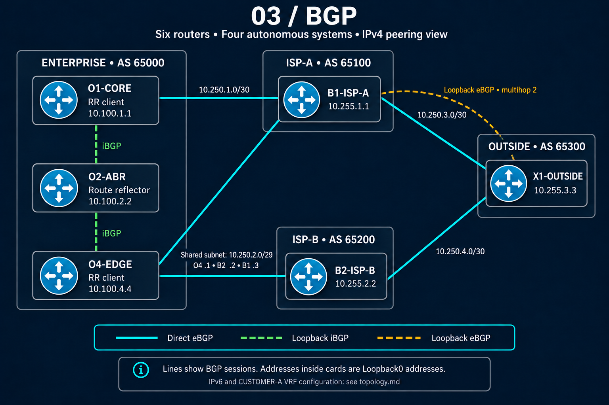

# BGP Enterprise Edge and Path-Selection Lab

## Overview

This lab implements a multi-autonomous-system Border Gateway Protocol (BGP) topology with an enterprise network, two upstream Internet service providers, and an external network. It demonstrates practical internal BGP (iBGP), external BGP (eBGP), route reflection, controlled prefix advertisement, policy enforcement, and BGP path-selection validation in a design representative of an enterprise edge.

## Lab Objectives

- Establish iBGP and eBGP neighbor relationships across a multi-AS topology.
- Use a route reflector to distribute BGP routes within the enterprise.
- Advertise the enterprise prefix `172.31.250.0/24` using exact BGP `network` statement behavior.
- Influence inbound and outbound routing with BGP attributes and route policy.
- Verify both control-plane path selection and data-plane forwarding.
- Build a repeatable foundation for real break/fix troubleshooting case studies.

## Topology



The topology places three enterprise routers in Autonomous System (AS) 65000 behind a dual-provider edge. O4-EDGE connects to B1-ISP-A in AS 65100 and B2-ISP-B in AS 65200. Both provider autonomous systems connect to X1-OUTSIDE in AS 65300.

## Device and AS Roles

| Device | AS | BGP Router ID | Role |
|---|---:|---|---|
| O1-CORE | 65000 | `10.100.1.1` | Enterprise core and iBGP peer |
| O2-ABR | 65000 | `10.100.2.2` | Enterprise iBGP route reflector with clients |
| O4-EDGE | 65000 | `10.100.4.4` | Enterprise eBGP edge connected to both providers |
| B1-ISP-A | 65100 | — | Upstream provider A |
| B2-ISP-B | 65200 | — | Upstream provider B |
| X1-OUTSIDE | 65300 | — | External network connected to both upstream autonomous systems |

O1-CORE and O2-ABR use iBGP. O2-ABR operated as a route reflector with clients in the completed lab, while O4-EDGE provided the enterprise's eBGP connectivity to both upstream providers.

## Key BGP Concepts Practiced

- iBGP and eBGP session establishment
- Route-reflector operation and client relationships
- Exact BGP `network` advertisement behavior, including the requirement for a matching route in the routing table
- BGP best-path analysis and attribute comparison
- Local Preference for influencing outbound enterprise path selection
- AS-PATH prepending for influencing remote inbound path selection
- Multi-Exit Discriminator (MED) manipulation
- Origin-code evaluation
- Prefix lists and route maps
- Inbound and outbound neighbor policy
- Control-plane and data-plane validation

## Policy and Path-Selection Exercises

The lab used `172.31.250.0/24` as the enterprise prefix for advertisement and policy exercises. Local Preference, AS-PATH length, MED, and Origin code were examined and modified to observe their effects on the selected BGP path.

A specific outbound policy on O4-EDGE matched the enterprise prefix and prepended AS 65000 twice when advertising it toward B2-ISP-B:

```cisco
ip prefix-list ENTERPRISE-PREPEND permit 172.31.250.0/24

route-map PREPEND-TO-B2 permit 10
 match ip address prefix-list ENTERPRISE-PREPEND
 set as-path prepend 65000 65000

route-map PREPEND-TO-B2 permit 20
```

The later permit sequence allows routes not matched by the prefix-specific sequence to continue through the route map. This exercise reinforced that a prefix list identifies which routes match, while the route map determines the policy action and whether unmatched routes are permitted or denied. The policy was applied outbound toward B2 so that advertisements of `172.31.250.0/24` carried the additional AS-PATH entries.

## Verification Strategy

Verification combined routing-state inspection with forwarding tests:

- Confirmed BGP neighbor establishment and address-family state.
- Inspected advertised and received prefixes where appropriate.
- Compared available paths, BGP attributes, and the installed best path.
- Validated route-map and prefix-list matches in the intended direction.
- Rechecked path selection after each policy change.
- Used traceroute to confirm that actual forwarding followed the expected provider path.

This approach distinguishes a successful BGP control-plane change from successful end-to-end data-plane behavior.

## Troubleshooting Focus

The lab emphasized systematic validation of neighbor state, exact prefix origination, policy direction, route-map sequencing, prefix-list matching, attribute changes, best-path selection, and forwarding behavior.

Detailed troubleshooting case-study files are intentionally not included yet. They will be added under `troubleshooting/` only as real break/fix scenarios are performed, validated, and documented.

## Repository Structure

```text
03-BGP/
├── README.md
├── topology.png
├── configs/
├── verification/
└── troubleshooting/
```

- `configs/` — device configurations from the completed lab
- `verification/` — captured BGP state, path-selection evidence, and forwarding validation
- `troubleshooting/` — future case studies based on completed break/fix testing

## Skills Demonstrated

- Designing and operating a multi-AS BGP topology
- Configuring enterprise iBGP, eBGP, and route reflection
- Implementing prefix-specific routing policy with prefix lists and route maps
- Manipulating BGP attributes to influence inbound and outbound traffic paths
- Interpreting BGP best-path decisions
- Validating routing policy through show-command evidence and traceroute
- Documenting enterprise routing work clearly for technical review
