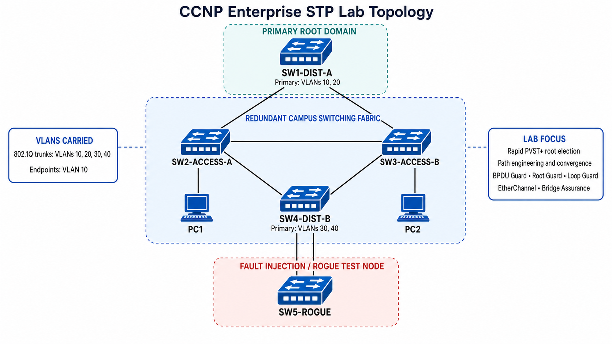

# CCNP Enterprise STP Masterclass

This project documents a hands-on Cisco Modeling Labs investigation of campus Layer 2 resiliency. I built a redundant switched topology, engineered different roots for different VLAN groups, observed Rapid PVST+ convergence, deliberately introduced unsafe conditions, and recovered the network using IOS evidence rather than guesswork.

The emphasis is operational: **build, verify, break, diagnose, restore**.

## Topology



The topology uses four production-role IOSvL2 switches, two VLAN 10 endpoints, and a fifth switch dedicated to fault injection. The campus trunks carry VLANs 10, 20, 30, and 40.

| Device | Lab role |
|---|---|
| `SW1-DIST-A` | Preferred root for VLANs 10/20; secondary for VLANs 30/40 |
| `SW4-DIST-B` | Preferred root for VLANs 30/40; secondary for VLANs 10/20 |
| `SW2-ACCESS-A` | Access switch for PC1 with redundant distribution uplinks |
| `SW3-ACCESS-B` | Access switch for PC2 with redundant distribution uplinks |
| `SW5-ROGUE` | Fault-injection node for superior-BPDU, trunk, and protection testing |
| `PC1`, `PC2` | VLAN 10 endpoints used to validate forwarding and recovery |

Physical redundancy comes from the SW1/SW2/SW3/SW4 diamond, the lateral SW2–SW3 trunk, and two independent links between SW4 and SW5. The image reflects the physical CML wiring; STP forwarding and blocking states vary by VLAN and experiment.

## Design objectives

- Run Rapid PVST+ with the long path-cost method.
- Make root placement deterministic instead of relying on default bridge IDs.
- Load-share VLAN groups across the two distribution switches.
- Validate port roles, root paths, alternate paths, and topology changes with live output.
- Test PortFast edge, BPDU Guard, Root Guard, Loop Guard, EtherChannel interaction, and Bridge Assurance.
- Record failure symptoms, IOS messages, inconsistent states, diagnosis, and recovery evidence.

## Root placement and VLAN policy

| VLANs | Primary root | Priority | Secondary root | Priority |
|---|---|---:|---|---:|
| 10, 20 | `SW1-DIST-A` | 24576 | `SW4-DIST-B` | 28672 |
| 30, 40 | `SW4-DIST-B` | 24576 | `SW1-DIST-A` | 28672 |

This split-root design makes the expected forwarding topology predictable while preserving a known backup root for each VLAN group.

## Evidence-driven workflow

The repository structure is intended to preserve the engineering record, not only a technology summary:

```text
04-STP/
├── README.md
├── topology.png
├── CCNP_MASTERCLASS_STP.yaml
├── configs/
├── verification/
│   ├── root-election/
│   ├── convergence/
│   ├── protection/
│   ├── path-engineering/
│   ├── etherchannel/
│   └── bridge-assurance/
└── troubleshooting/
```

The supporting evidence in the full portfolio is organized around commands such as:

```text
show spanning-tree vlan 10
show spanning-tree vlan 30
show spanning-tree detail
show spanning-tree summary
show spanning-tree inconsistentports
show interfaces trunk
show interfaces status err-disabled
show etherchannel summary
show logging
```

Each captured result should answer four questions: what was expected, what IOS actually reported, why the observed port state occurred, and what changed after recovery.

## Failure-injection focus

The rogue node and redundant trunks support controlled troubleshooting scenarios including:

- a BPDU arriving on a PortFast edge port and triggering BPDU Guard;
- a superior BPDU being rejected by Root Guard;
- missing BPDUs causing a Loop Guard inconsistent state;
- native-VLAN or allowed-VLAN inconsistencies affecting trunk behavior;
- EtherChannel membership or VLAN-mask mismatches;
- Bridge Assurance detecting a unidirectional or non-network port condition.

Recovery is verified with the relevant `show` output and endpoint forwarding tests rather than inferred from configuration alone.

## Lab files

- [`CCNP_MASTERCLASS_STP.yaml`](CCNP_MASTERCLASS_STP.yaml) — importable Cisco Modeling Labs topology with the device configurations used for this lab.
- [`topology.png`](topology.png) — portfolio-ready physical topology diagram.

## Skills demonstrated

- Rapid PVST+ root-bridge design and per-VLAN load sharing
- STP tie-break analysis, path-cost engineering, and convergence validation
- Layer 2 edge and root-domain protection
- Inconsistent-port and err-disable diagnosis
- EtherChannel and STP interaction
- Bridge Assurance behavior
- Evidence-based fault isolation and recovery

