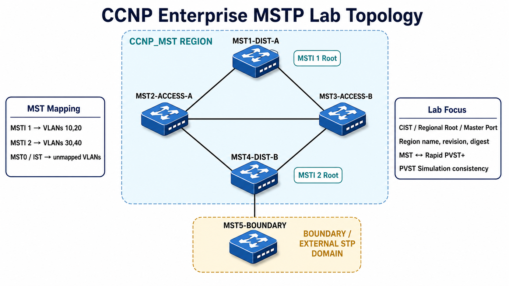

# CCNP Enterprise MSTP Masterclass

This lab is an evidence-driven Multiple Spanning Tree Protocol engineering project: **build → verify → break → diagnose → restore**. It moves beyond a working configuration to prove region identity, per-instance root engineering, boundary behavior, CIST operation, and MST-to-Rapid-PVST+ consistency handling with captured IOS evidence.



## Topology and design

The four-switch `CCNP_MST` region forms a redundant diamond: **MST1-DIST-A** is top center, **MST2-ACCESS-A** is left, **MST3-ACCESS-B** is right, and **MST4-DIST-B** is bottom center. The access switches also have a lateral link. **MST5-BOUNDARY** connects below MST4 and is used first as another MST region, then as a Rapid PVST+ interoperability node.

| Region setting | Value |
|---|---|
| Name | `CCNP_MST` |
| Revision | `1` |
| MSTI 1 | VLANs `10,20` |
| MSTI 2 | VLANs `30,40` |
| MSTI 1 root | `MST1-DIST-A` (priority 24576) |
| MSTI 2 root | `MST4-DIST-B` (priority 24576) |
| MST0 / IST | All VLANs not explicitly mapped |

This produces real per-instance path diversity: MST2-ACCESS-A reaches MSTI 1 through `Gi0/0` toward MST1, but reaches MSTI 2 through `Gi0/1` toward MST4.

## What this lab demonstrates

- **MST0 / IST:** instance 0 exists in every region and carries unmapped VLANs.
- **CIST:** the Common and Internal Spanning Tree connects MST regions and external STP domains.
- **MSTI roots:** each instance elects independently, allowing VLAN groups to use different Layer 2 paths.
- **CIST Root vs. CIST Regional Root:** the global root and the best bridge inside a region toward that root are distinct roles.
- **Master Port:** the MSTI representation of a region's best external CIST path; observed as `Mstr FWD`.
- **Boundary Port:** a link to a different MST region (`Bound(RSTP)`) or PVST/Rapid PVST+ domain (`Bound(PVST)`).
- **Configuration digest:** a fingerprint of the VLAN-to-instance mapping. Name and revision are evaluated separately.
- **Max Hops:** MST's internal BPDU lifetime; captured as configured `max hops 20` and `rem hops 19/18`.
- **Long path cost:** IOS reports short as configured but long as operational under MST; 1-Gb links display cost `20000`.
- **MST/PVST Simulation:** boundary consistency checks can logically block an up link as `*PVST_Inc` and recover automatically.

## Engineering workflow

1. Created VLANs and trunks, then staged the same region configuration on MST1-MST4.
2. Verified name, revision, mapping, and digest before enabling MST mode.
3. Engineered MST1 as the MSTI 1 root and MST4 as the MSTI 2 root.
4. Verified distinct access-switch root ports and instance-specific forwarding.
5. Used MST5 as a separate region and lower-priority external CIST root to expose Boundary, Regional Root, Root, and Master roles.
6. Broke region membership independently through revision, mapping/digest, and name changes.
7. Converted MST5 to Rapid PVST+ and triggered both PVST Simulation consistency failure directions.
8. Restored each condition and verified automatic forwarding recovery.

## Repository map

```text
05-MSTP/
├── README.md
├── CCNP_MASTERCLASS_MSTP.yaml
├── topology.png
├── configs/
│   ├── README.md
│   └── five per-device running configurations
├── verification/
│   ├── region/
│   ├── instances/
│   ├── root-engineering/
│   ├── boundary-master/
│   ├── region-mismatch/
│   ├── pvst-simulation/
│   └── operational/
└── troubleshooting/
    ├── scenario-1-revision-mismatch/
    ├── scenario-2-mapping-digest-mismatch/
    ├── scenario-3-region-name-mismatch/
    ├── scenario-4-external-cist-root-boundary/
    ├── scenario-5-pvst-sim-superior-vlan/
    ├── scenario-6-pvst-sim-inferior-vlan/
    └── scenario-7-transient-dispute/
```

## Evidence guide

| Area | Principal commands | What it proves |
|---|---|---|
| [Region](verification/region/) | `show spanning-tree mst configuration`, `... digest` | Matching region definition and digest |
| [Instances](verification/instances/) | `show spanning-tree mst`, `mst 0`, `mst 1`, `mst 2` | IST, mappings, roles, and independent topologies |
| [Root engineering](verification/root-engineering/) | `show spanning-tree mst 1/2` | Intended roots and access-layer path selection |
| [Boundary/Master](verification/boundary-master/) | `show spanning-tree mst` | Regional Root plus `Root`/`Mstr` boundary behavior |
| [Region mismatch](verification/region-mismatch/) | configuration digest and MST output | Revision, mapping, and name failure signatures |
| [PVST Simulation](verification/pvst-simulation/) | MST, VLAN, inconsistent-port output, syslog | `Bound(PVST)`, failure, logical block, and recovery |
| [Operational](verification/operational/) | summary and MST instance output | Max Hops, remaining hops, long costs, transient Dispute |

## Lab files

- [Device configurations](configs/)
- [Verification evidence](verification/)
- [Troubleshooting case studies](troubleshooting/)
- [CML topology](CCNP_MASTERCLASS_MSTP.yaml)
- [Topology image](topology.png)

> Evidence policy: `.txt` files labeled **captured output** reproduce console material observed during the masterclass. Scenario READMEs may summarize command sequences when the exact console block was not retained; they do not fabricate IOS output.
