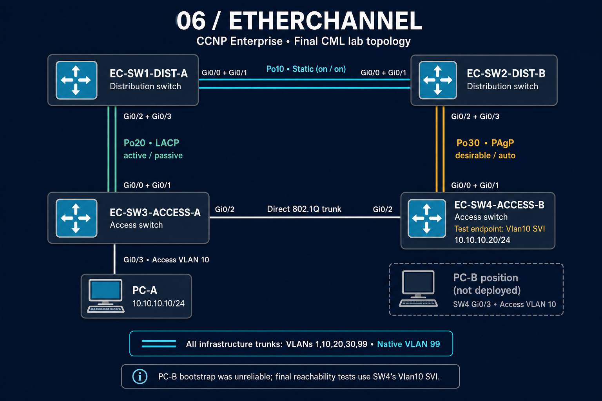

# 06 — EtherChannel

CCNP ENCOR portfolio lab demonstrating static EtherChannel, LACP, PAgP, 802.1Q trunking, PVST interaction, member resiliency, hashing behavior, and fault isolation on Cisco IOSvL2 in CML.

## Evidence policy

This module is built only from the uploaded final CML export and command output preserved in the referenced lab conversation. Raw captures are stored as text without invented lines. Where the conversation discussed a feature but did not provide a reusable raw capture, the coverage matrix says so explicitly.

`CML-LAB.yaml` is the final exported topology and configuration source of truth. The files under `configs/` are verbatim, de-indented copies of the four IOSvL2 configuration blocks embedded in that export, separated for easier review. Earlier user-posted console captures were used to cross-check the intended state but are not presented as the source of those four extracted files.

## Topology



PC-B is shown only as an unused endpoint position; it is absent from the final CML export. Its bootstrap was unreliable, so final reachability tests use SW4's Vlan10 SVI at 10.10.10.20/24.

```text
                          Static Po10
EC-SW1-DIST-A ================================= EC-SW2-DIST-B
      ||                                                   ||
      || LACP Po20                               PAgP Po30 ||
      ||                                                   ||
EC-SW3-ACCESS-A -------- Gi0/2 trunk -------- EC-SW4-ACCESS-B
      |
    PC-A
```

| Bundle/link | Endpoints | Members | Final mode |
|---|---|---|---|
| Po10 | SW1 ↔ SW2 | Gi0/0, Gi0/1 | Static `on` ↔ `on` |
| Po20 | SW1 ↔ SW3 | SW1 Gi0/2–3, SW3 Gi0/0–1 | LACP `active` ↔ `passive` |
| Po30 | SW2 ↔ SW4 | SW2 Gi0/2–3, SW4 Gi0/0–1 | PAgP `desirable` ↔ `auto` |
| Direct trunk | SW3 ↔ SW4 | Gi0/2 ↔ Gi0/2 | 802.1Q trunk |

All infrastructure trunks use native VLAN 99 and allow VLANs `1,10,20,30,99`. PC-A is `10.10.10.10/24` in VLAN 10. The final test endpoint is SW4 `Vlan10`, `10.10.10.20/24`.

## Final known-good state

- Po10, Po20, and Po30 are Layer 2/in-use (`SU`), with every intended member bundled (`P`).
- Po20 negotiation is SW1 active to SW3 passive; Po30 negotiation is SW2 desirable to SW4 auto.
- Every logical Port-channel is an 802.1Q trunk with native VLAN 99 and VLANs `1,10,20,30,99` allowed and active.
- On SW2, Po30 is a healthy trunk and bundle but is PVST alternate/blocking for all carried VLANs. STP is blocking the logical Port-channel, not individual members.
- The final PC-A-to-SW4 check completed 10/10 replies with 0% loss.
- Load balancing is restored to `src-dst-ip`.
- Temporary secondary IP addresses and advanced-LACP test settings were removed before export.

See `verification/` for the raw final-state captures and `configs/` for the final configurations extracted from the export.

## Troubleshooting highlights

### Direct trunk failure and STP failover

Shutting the SW3–SW4 direct trunk caused a visible classic-PVST convergence outage. The continuous ping missed approximately sequences 8–53, then recovered. MAC learning proved the alternate forwarding path hop by hop:

```text
SW3 Po20 (LACP) → SW1 Po10 (static) → SW2 Po30 (PAgP) → SW4
```

After the direct trunk returned and STP reconverged, SW3 relearned the SW4 endpoint MAC on Gi0/2.

### Single LACP member failure

With traffic forced through Po20, shutting SW3 Gi0/1 changed the member from `(P)` to `(D)` while Po20 remained `(SU)`. The live ping completed 60/60 with 0% loss. PVST cost changed from 3 (two 1-Gb members) to 4 (one member), then returned to 3 after recovery; the Port-channel stayed forwarding.

### Member VLAN-mask mismatch

Removing VLAN 99 from only SW3 Gi0/0 produced `%EC-5-CANNOT_BUNDLE2` with `vlan mask is different`. Gi0/0 became suspended `(s)`, while Po20 remained operational on Gi0/1. Restoring the allowed VLAN list returned Gi0/0 to `(P)`.

### `lacp max-bundle 1` IOSv anomaly

The CLI accepted `lacp max-bundle 1` and displayed the expected active/hot-standby states, but real forwarding failed: PC-A saw 100% loss and both ends showed zero received BPDUs on Po20. Symmetric configuration did not repair forwarding. Removing only `max-bundle` restored both members to `(P)`, ping to 0% loss, and received BPDU counters above zero. Treat this as an IOSvL2 image limitation, not expected production LACP behavior.

### Hashing verification

The image supports MAC- and IP-based algorithms but no TCP/UDP-port algorithm. Real traffic plus member counters showed one source/destination IP flow selecting one member and several different IP inputs still mapping to the same member. This proves deterministic per-flow hashing and explains why a healthy bundle can be unevenly utilized.

## Coverage matrix

| Area | Status | Evidence / boundary |
|---|---|---|
| Static Po10 formation | Configured / proven | Final configs and all-switch summary captures |
| LACP Po20 active/passive | Configured / proven | Final configs, summaries, and `show lacp neighbor` |
| PAgP Po30 desirable/auto | Configured / proven | Final configs, summaries, and `show pagp neighbor` |
| LACP active/active and passive/passive behavior | Configured / proven in conversation | Lab summary records both; no separate raw failure capture is included here |
| PAgP auto/auto failure | Configured / proven in conversation | Lab summary records the test; no separate raw failure capture is included here |
| Static asymmetric-member risk | Configured / proven in conversation | Lab summary records the test; no separate raw capture is included here |
| 802.1Q/native VLAN 99/allowed VLANs | Configured / proven | All four trunk captures and final configs |
| VLAN database | Configured / proven | SW1 `show vlan brief` capture |
| STP treats a bundle as one link | Configured / proven | SW2 Po30 alternate/blocking capture |
| Direct-trunk failover through all three bundles | Configured / proven | Ping outage/recovery and hop-by-hop MAC learning |
| One-member LACP failure/recovery | Configured / proven | Live pings, summaries, and STP cost 3 → 4 → 3 |
| Inconsistent allowed-VLAN member | Configured / proven | Syslog, suspended member, switchport output, and recovery |
| LACP system priority | Configured / proven, then removed | `32768 → 1 → 32768`; IOSv caused a temporary Po20 renegotiation/flap |
| LACP port priority/member selection | Configured / proven, then removed | Priority `1` moved the preferred bundled member under max-bundle testing |
| Load-balancing algorithms and per-flow hashing | Configured / proven | Capability output, counters, and final `src-dst-ip` state |
| Single-flow aggregate-bandwidth limitation | Discussed | One flow hashes to one member; no throughput generator result was captured |
| LACP Fast (`lacp rate fast`) | Platform-limited | Per-interface CLI exposed only `lacp port-priority` |
| `port-channel min-links` | Platform-limited | Conversation records the command as rejected by IOSvL2; no raw rejection capture included here |
| Layer-4 port hashing | Platform-limited | Capability output lists only MAC/IP algorithms |
| `test etherchannel load-balance` | Platform-limited | Conversation records the command as unsupported; counters were used instead |
| `lacp max-bundle 1` forwarding | Platform-limited / unreliable | Expected `(P)/(H)` state appeared, but traffic and BPDUs failed until removed |
| `lacp fast-switchover` | Skipped | CLI present, but depends on unreliable `max-bundle 1` behavior on this image |
| Standalone forwarding failure test | Skipped | Default/non-default config behavior was verified; destructive forwarding test avoided due loop risk |
| Full Layer 3 EtherChannel | Skipped | Routed Port-channel CLI support proven with temporary Po40; no spare links for a physical L3 bundle |

## Artifact map

```text
06-ETHERCHANNEL/
├── README.md
├── topology.png
├── CML-LAB.yaml
├── configs/
├── verification/
└── troubleshooting/
```

The exported YAML contains the complete node/link map and final embedded configurations. Raw verification filenames are descriptive so each claim can be traced without reformatting the device output.
