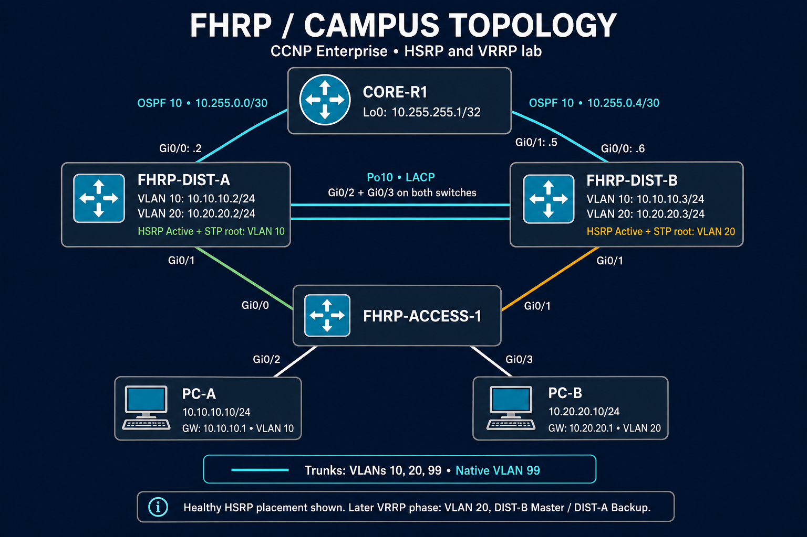
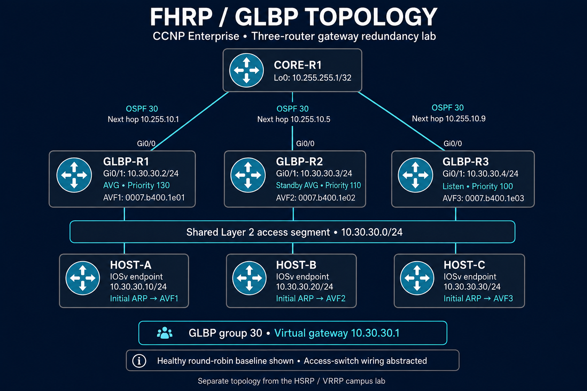

# FHRP topology and protocol stages

### HSRP and VRRP campus lab

Two distribution devices serve the client VLANs through a redundant access switch. An inter-distribution EtherChannel connects DIST-A and DIST-B, and routed OSPF uplinks connect both distribution devices to CORE-R1.

| Network | Virtual gateway | DIST-A | DIST-B | Preferred HSRP gateway |
|---|---|---|---|---|
| VLAN 10 | `10.10.10.1` | `10.10.10.2` | `10.10.10.3` | DIST-A |
| VLAN 20 | `10.20.20.1` | `10.20.20.2` | `10.20.20.3` | DIST-B |

HSRP initially served both VLANs. The later VRRP phase reused VLAN 20 with DIST-B as the preferred Master and DIST-A as Backup. The upstream test destination was CORE-R1's `10.255.255.1` loopback.

### GLBP lab

GLBP used a separate three-router topology with IOSv endpoints HOST-A, HOST-B, and HOST-C. Each GLBP router had an independently verified OSPF path to CORE-R1. Group 30 used virtual gateway **10.30.30.1** and the same upstream test destination, **10.255.255.1**.

| Device | Client-facing address | Preferred gateway role after AVG preemption | Initial virtual forwarder |
|---|---|---|---|
| GLBP-R1 | `10.30.30.2` | AVG, priority 130 | AVF1 — `0007.b400.1e01` |
| GLBP-R2 | `10.30.30.3` | Standby AVG, priority 110 | AVF2 — `0007.b400.1e02` |
| GLBP-R3 | `10.30.30.4` | Listen, priority 100 | AVF3 — `0007.b400.1e03` |

Both images illustrate the documented topology stages. The campus image shows healthy HSRP placement; the GLBP image abstracts access-switch wiring as a shared Layer 2 segment. Device roles changed during the documented tests.

[Configuration guide](configs/README.md) · [Module overview](README.md)
