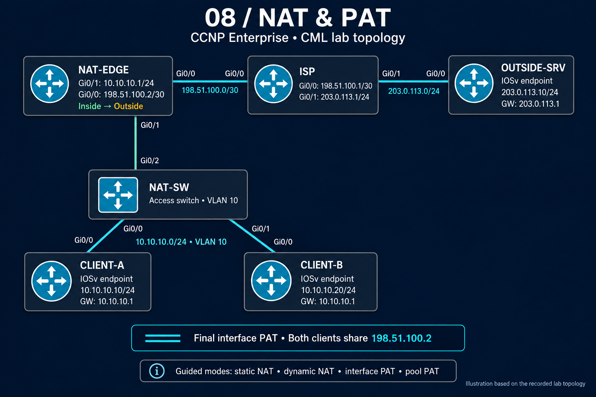

# NAT/PAT topology and addressing

Both clients reach NAT-EDGE through NAT-SW. Gi0/1 is NAT-EDGE's inside boundary; Gi0/0 connects to ISP. ISP forwards to OUTSIDE-SRV. Device names, addressing, and port connections follow the lab record.

| Device / role | Address or connection |
|---|---|
| CLIENT-A Gi0/0 | `10.10.10.10/24`; gateway `10.10.10.1`; NAT-SW Gi0/0 |
| CLIENT-B Gi0/0 | `10.10.10.20/24`; gateway `10.10.10.1`; NAT-SW Gi0/1 |
| Extra guided source on CLIENT-B | Secondary `10.10.10.30/24`, used to test a third inside identity |
| NAT-SW Gi0/2 | Connects to NAT-EDGE Gi0/1; inside access VLAN 10 |
| NAT-EDGE inside Gi0/1 | `10.10.10.1/24` |
| NAT-EDGE outside Gi0/0 | `198.51.100.2/30`; default route via `198.51.100.1` |
| ISP Gi0/0 / Gi0/1 | `198.51.100.1/30` / `203.0.113.1/24` |
| OUTSIDE-SRV Gi0/0 | `203.0.113.10/24`; gateway `203.0.113.1` |
| Static NAT global | `198.51.100.10`, routed by an ISP `/32` toward NAT-EDGE |
| Dynamic NAT / pool PAT range | `192.0.2.10–192.0.2.11`, routed by ISP via `198.51.100.2` |
| Interface PAT global | `198.51.100.2` |

These are isolated lab addresses. Here, **inside local** is the client's original address, **inside global** is its translated identity, and the server's outside-local and outside-global values are both `203.0.113.10` in the retained tables.

[Configuration guide](configs/README.md) · [Module overview](README.md)
