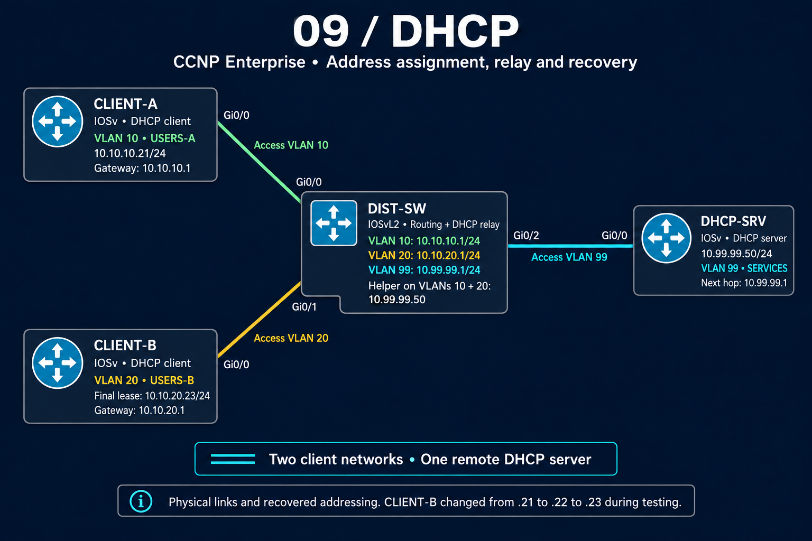

# Topology and addressing

Two client networks share one DHCP server. DIST-SW provides the gateway for each network and forwards initial DHCP requests to the server.

## Devices and networks

| Device/interface | Network or address | Role |
|---|---|---|
| CLIENT-A Gi0/0 | VLAN 10; observed `10.10.10.21/24` | DHCP client; gateway `10.10.10.1` |
| CLIENT-B Gi0/0 | VLAN 20; final `10.10.20.23/24` | DHCP client; gateway `10.10.20.1` |
| DIST-SW Vlan10 | `10.10.10.1/24` | USERS-A gateway and relay |
| DIST-SW Vlan20 | `10.10.20.1/24` | USERS-B gateway and relay |
| DIST-SW Vlan99 | `10.99.99.1/24` | SERVICES gateway |
| DHCP-SRV Gi0/0 | `10.99.99.50/24` | Server; default route via `10.99.99.1` |

The server excludes `.1–.20` in each client subnet. Both pools advertise `8.8.8.8` as a DNS option; this lab did not verify access to that resolver.

## Exact physical connections

| Endpoint | DIST-SW port | Link type |
|---|---|---|
| CLIENT-A Gi0/0 | Gi0/0 | Access VLAN 10 |
| CLIENT-B Gi0/0 | Gi0/1 | Access VLAN 20 |
| DHCP-SRV Gi0/0 | Gi0/2 | Access VLAN 99 |

There are three physical links. Routing occurs through the switch's VLAN interfaces; there are no trunks or port-channels in this topology.

## How a new client reaches the server

DIST-SW relays requests received on Vlan10 and Vlan20 to `10.99.99.50`. For CLIENT-B, the [server trace](verification/08-relayed-dora-and-new-binding.txt) identifies relay `10.10.20.1`, followed by an offer and acknowledgment for `10.10.20.22`.

The diagram follows the setup recorded in Part 3, message `578bbeb5-6803-48b6-a00b-662f83720426`, and the later lease evidence. It is a portfolio illustration, not an exported CML screenshot. Node types are IOSvL2 for DIST-SW and IOSv for the other three devices.

[Section overview](README.md) · [Configuration guide](configs/README.md)

