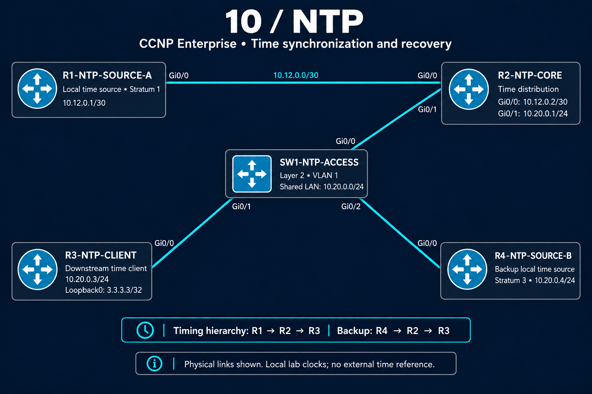

# 10 — NTP: Time synchronization and recovery

Consistent time helps engineers compare logs and reconstruct the sequence of a network incident. This lab examines how time reaches a client, how a backup source takes over, and why a device can answer a ping while its time service fails.

I built a five-device Cisco Modeling Labs environment with two local time sources and a downstream client. I verified the timing hierarchy, tested source failure and recovery, and isolated two communication faults introduced when the client began using a loopback address.

**5 devices · 2 time sources · 3 troubleshooting cases · 34 evidence blocks**

## Results at a glance

| Problem or test | What I established | Recorded result |
|---|---|---|
| The primary time-source link was taken down | The core could select the backup and continue supplying time downstream | R2 reported synchronized at stratum 4; R3 reported synchronized at stratum 5 |
| The restored primary responded but was not selected | Reachability and lower stratum did not guarantee source acceptance | R1 remained marked as a falseticker while R4 stayed selected |
| NTP failed after switching to a loopback source | R2 lacked a return route to the client's new source address | Adding the /32 route changed sourced ping from 0/5 to 5/5 and NTP reach from 0 to 17 |
| Ping worked while NTP failed | An inbound ACL denied UDP/123 from the loopback address | Correcting one entry restored NTP reach to 1; its permit counter reached 37 |

## Start with the evidence

Read [Case 03 — Ping works, but time updates stop](troubleshooting/03-acl-udp123.md) for the clearest troubleshooting sequence: a successful connectivity test, a protocol-specific failure, an exact policy match, and a verified correction.

For source-selection behavior, read [Case 01 — A backup takes over, but recovery is not immediate](troubleshooting/01-source-failover.md). It includes both successful failover and the limitations exposed by two independent local clocks.

## Lab design

| Device | Responsibility |
|---|---|
| R1-NTP-SOURCE-A | Local stratum 1 source |
| R2-NTP-CORE | Receives time from R1 or R4 and supplies it to R3 |
| R3-NTP-CLIENT | Downstream client; later sources NTP from Loopback0 |
| R4-NTP-SOURCE-B | Independent local stratum 3 backup source |
| SW1-NTP-ACCESS | Layer 2 connectivity for R2, R3 and R4 |

The baseline hierarchy is **R1 → R2 → R3**, with recorded strata **1 → 2 → 3**. The backup hierarchy is **R4 → R2 → R3**, with recorded strata **3 → 4 → 5**. These numbers describe the timing hierarchy; neither local source was checked against an external clock.

[View addressing and wiring](topology.md) · [Import and reproduce the lab](configs/README.md)

## What this work demonstrates

- **Layered diagnosis:** distinguish IP reachability, NTP packet exchange, source acceptance, and clock synchronization.
- **Source-aware testing:** test with the address the service actually uses, then check its return route and policy.
- **Controlled repairs:** correct the missing route or matching ACL entry and inspect the resulting behavior.
- **Evidence-based conclusions:** retain transitional states and stop each claim at what the captured output proves.

## Explore the files

| Location | What you will find |
|---|---|
| [Troubleshooting](troubleshooting/README.md) | Three cases with direct links to supporting blocks |
| [Verification](verification/README.md) | Four evidence pages, field explanations and capture conventions |
| [Configurations](configs/README.md) | Original CML export, five extracted device configs and later change steps |

## Evidence scope

These controlled exercises use IOSv local clocks. They demonstrate hierarchy, source selection and communication recovery; they do not measure UTC accuracy or guarantee uninterrupted synchronization during failover.

The routing and ACL cases end with restored NTP exchanges, without a final synchronized status capture on R3. The preference change was confirmed during the exercise; its running-config was not captured. Symmetric peering and authentication were not tested.

[Back to portfolio](../README.md)
