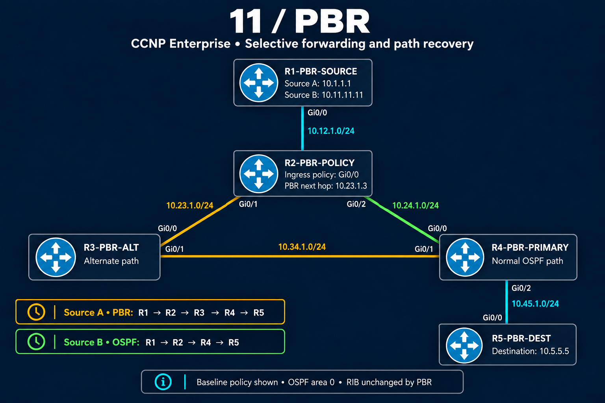

# PBR topology and addressing

Five IOSv routers provide a normal OSPF path and an alternate branch. R2 applies PBR to traffic received from R1 on Gi0/0. The diagram depicts the restored baseline policy.

## Physical links

| Endpoint | Endpoint | Subnet |
|---|---|---|
| R1 Gi0/0 — 10.12.1.1 | R2 Gi0/0 — 10.12.1.2 | 10.12.1.0/24 |
| R2 Gi0/1 — 10.23.1.2 | R3 Gi0/0 — 10.23.1.3 | 10.23.1.0/24 |
| R2 Gi0/2 — 10.24.1.2 | R4 Gi0/0 — 10.24.1.4 | 10.24.1.0/24 |
| R3 Gi0/1 — 10.34.1.3 | R4 Gi0/1 — 10.34.1.4 | 10.34.1.0/24 |
| R4 Gi0/2 — 10.45.1.4 | R5 Gi0/0 — 10.45.1.5 | 10.45.1.0/24 |

The lab screenshot establishes the wiring. [Interface captures — Blocks 01–05](verification/01-baseline.md#block-01) establish the assigned addresses and up/up state during setup.

## Sources and destination

| Interface | Configured address | Purpose |
|---|---|---|
| R1 Loopback0 | 10.1.1.1/24 | Source A; matches the baseline policy |
| R1 Loopback1 | 10.11.11.11/24 | Source B; follows normal routing in the baseline |
| R5 Loopback0 | 10.5.5.5/24 | Shared test destination |

The /24 loopback masks come from the configuration steps. R2's captured OSPF route to the destination is **10.5.5.5/32**. Preserve that distinction when comparing interface configuration with routing output.

All links and loopbacks participate in OSPF process 1, area 0. Router IDs are 1.1.1.1 through 5.5.5.5 for R1 through R5.

## Paths to compare

| State | Source A | Source B |
|---|---|---|
| Restored baseline policy | R1 → R2 → R3 → R4 → R5 | R1 → R2 → R4 → R5 |
| Reversed ACL classifier | R1 → R2 → R4 → R5 | R1 → R2 → R3 → R4 → R5 |
| Route-map deny 10 / permit 20 | R1 → R2 → R4 → R5 | R1 → R2 → R3 → R4 → R5 |

R1 generates the probes locally, but they arrive as transit traffic at **R2**, where the policy is installed. This is an interface-PBR test, not a local-PBR test on R2.

[Back to PBR](README.md)
