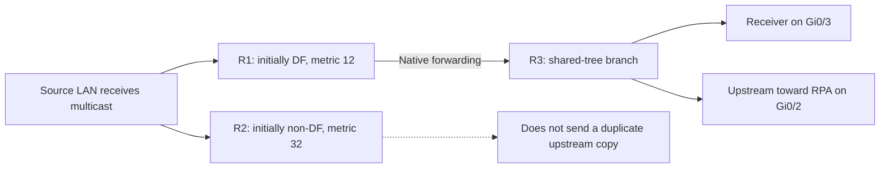
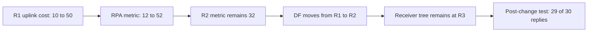

# BIDIR behavior — separate DR, DF and receiver state

## Two elections on the source LAN

| Role | Selection in this lab | Responsibility |
|---|---|---|
| PIM Designated Router | R2: equal priority, higher interface address | Ordinary PIM DR role; this does not select the BIDIR source forwarder |
| BIDIR Designated Forwarder | Initially R1: better route toward RPA `4.4.4.4` | Forward traffic between the LAN and the bidirectional tree without parallel copies |

DF selection is per RPA and link, not a single router elected for the whole network. It compares route preference and metric; this lab holds the routing protocol and preference constant and changes the OSPF metric. The ordinary DR priority/IP election remains unchanged.

This diagram explains the forwarding rules and captured roles. It is not a packet capture of every branch.

## Why the RPA still matters

The Rendezvous Point Address orients the shared tree and supplies the routing target used for DF selection. This lab assigns `4.4.4.4` to R4's Loopback0. R3 points upstream through Gi0/2 toward `10.34.0.2`.

At R3, traffic can be copied directly to the receiver on Gi0/3 when it reaches that branch. Receiver delivery does not require a trip to R4 and back. R3's upstream interface also appears in its outgoing list; the diagram does not imply that no copy travels toward the RPA.

## Interpret the tables in context

After receiver placement was corrected, R3 showed `(*,239.100.100.100)` with `BC`: Bidir group and connected receiver interest. When the source sent traffic, R1 and R2 returned `Group not found` for the group-specific lookup, while R3 retained the receiver branch and replies reached the source.

That combination is consistent with BIDIR forwarding on a source-only branch using the RPA/DF state. It should not be diagnosed as an outage from the group lookup alone. Conversely, the earlier existence of a Bidir entry did not establish a receiver on Gi0/3; the IGMP reporter and outgoing interface identified the actual receiver location.

BIDIR uses native shared-tree forwarding without the ordinary PIM-SM Register/Register-Stop and source-tree switchover process. The lab retained `(*,G)` output at R3, not a packet capture of protocol-message absence. Its ping timings do not establish that BIDIR is faster than PIM-SM.

## Change the route, then check the service

The post-change neighbor table still marks R2 as DR. The two roles now reside on R2 for different reasons.

[Role evidence](verification/02-roles.md) · [Forwarding evidence](verification/03-receiver-forwarding.md) · [Transition case](troubleshooting/03-df-transition.md) · [Overview](README.md)
