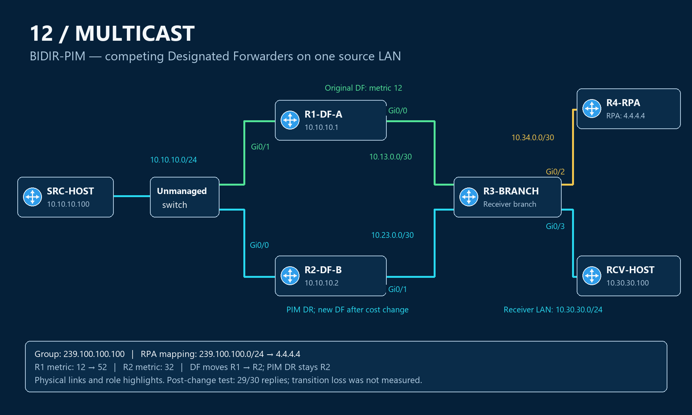

# BIDIR topology — two possible forwarders on one source LAN

Six IOSv nodes and one unmanaged switch form a dedicated lab. R1 and R2 share the source LAN and have separate uplinks to R3. R3 connects both the receiver and R4's RPA. This makes DF selection visible without changing the receiver's attachment.

## Wiring and addressing

| Link | First endpoint | Second endpoint | Subnet |
|---|---|---|---|
| Shared source LAN | SRC-HOST Gi0/0, 10.10.10.100 | Unmanaged switch | 10.10.10.0/24 |
| R1 to source LAN | R1 Gi0/1, 10.10.10.1 | Same switch | 10.10.10.0/24 |
| R2 to source LAN | R2 Gi0/0, 10.10.10.2 | Same switch | 10.10.10.0/24 |
| R1 to R3 | R1 Gi0/0, 10.13.0.1 | R3 Gi0/0, 10.13.0.2 | 10.13.0.0/30 |
| R2 to R3 | R2 Gi0/1, 10.23.0.1 | R3 Gi0/1, 10.23.0.2 | 10.23.0.0/30 |
| R3 to RPA | R3 Gi0/2, 10.34.0.1 | R4 Gi0/0, 10.34.0.2 | 10.34.0.0/30 |
| Receiver LAN | R3 Gi0/3, 10.30.30.1 | RCV-HOST Gi0/0, 10.30.30.100 | 10.30.30.0/24 |

R1–R4 use Loopback0 addresses `1.1.1.1` through `4.4.4.4`. OSPF area 0 supplies reachability; `4.4.4.4/32` is the RPA. The final group selector is `239.100.100.0/24`; the test group is `239.100.100.100`.

## Read the diagram

The drawing shows corrected wiring and both possible source branches. Green is R1's original DF branch; cyan is R2's branch after the metric change; gold points toward the RPA. R2 is PIM DR in both captured states. Receiver delivery branches at R3, while R3 also lists Gi0/2 as Bidir-Upstream.

R1's real interface placement differs from the first setup draft. Its captured descriptions still reflect that older draft; use the address and adjacency evidence to identify the actual links.

[Configuration files](configs/README.md) · [Role and packet-flow explanation](operation.md) · [DF transition](troubleshooting/03-df-transition.md) · [Overview](README.md)
