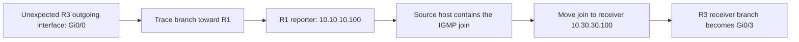

# Case 02 — the multicast tree follows a join on the wrong host

**Result:** moving the group membership to RCV-HOST made R3 learn reporter `10.30.30.100` on Gi0/3 and add the intended receiver branch. The earlier tree was correctly following an unintended subscription.

## Symptom

R3 had a Bidir group entry, but its outgoing list pointed toward R1 on Gi0/0. The test group was absent from R3's local IGMP table, and the expected receiver-facing Gi0/3 was not in the outgoing list.

## Investigation and root cause

The source-host interface configuration contained `ip igmp join-group 239.100.100.100` alongside address `10.10.10.100` and a source-LAN description. R1 independently listed `10.10.10.100` as its IGMP reporter on Gi0/1. These checks located the receiver interest on the wrong side of the topology.

[Blocks 11–12 — tree direction and wrong-host configuration](../verification/03-receiver-forwarding.md)

## Remediation and validation

Remove the join from SRC-HOST. Confirm RCV-HOST's address before applying it there. The subsequent R3 membership table listed `10.30.30.100` on Gi0/3; its `(*,G)` entry showed `BC` and Gi0/3 Forward/Sparse.

The later source test captured replies 0–42 from the intended receiver. Its command requested 100 probes, but the transcript does not retain the entire run.

[Blocks 13–15 — receiver identity, corrected tree and replies](../verification/03-receiver-forwarding.md#block-13--confirm-the-intended-receiver-identity)

## Lesson

Use the reporter address and outgoing interface to locate receiver interest. A valid RP mapping or a group entry by itself cannot establish that the intended host joined. Verify the device identity before applying a role-specific command.

[Correction commands](../configs/experiments.md) · [All cases](README.md) · [Overview](../README.md)
