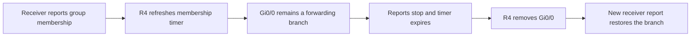

# IGMPv2 — keeping receiver interest current

**Objective:** connect receiver reports, membership timers and the outgoing multicast interface on R4. The group is `239.1.1.1`, and receiver `10.4.4.10` reaches R4 through Gi0/0.

## What the lab showed

| Checkpoint | Recorded state | Meaning |
|---|---|---|
| Baseline | Version 2; querier `10.4.4.1`; last reporter `10.4.4.10` | R4 maintains membership for the receiver LAN |
| Reports stop | Expiry falls from 1:10 to 0:08 | Existing membership remains until its timer expires |
| Expiry | Debug deletes Gi0/0 at 21:21:16.510 | The receiver branch is removed |
| Rejoin | Report received at 21:23:48.034; Gi0/0 returns | New interest restores the branch |

The return report preceded R4's next general query. A joining host can report immediately; it does not need to wait for a query. Later reports refreshed the membership again.

## Separate the mechanisms

IGMPv2 general queries go to `224.0.0.1`; membership reports go to the group being joined. On a multi-router LAN, the lowest interface address wins the IGMP querier election. The PIM DR election is separate. R4 held both roles in this single-router receiver LAN; no querier failover was tested here.

A received Leave goes to `224.0.0.2` and normally triggers group-specific queries before membership is removed. That exchange was **not captured** in this run: the recorded removal followed timer expiry. A later activity counter containing a leave does not replace a packet or debug record of a Leave message.

Report suppression lets IGMPv2 hosts avoid redundant reports after hearing another host report the same group. Consequently, Last Reporter is not a count or inventory of all receivers. Multiple-host suppression was covered conceptually, not demonstrated by this one-receiver capture.

## Engineering lessons

- Correlate membership expiry with the outgoing interface rather than treating a route's existence as proof of local interest.
- Filter debug interpretation by group and interface; `224.0.1.40` is separate from the test group.
- IOS can describe v2 membership internally using EXCLUDE terminology. That wording alone does not prove an IGMPv3 report was received.

[Configuration](configs/README.md) · [Recorded evidence](verification/01-v2-membership.md) · [Expiry case](troubleshooting/01-membership-expiry.md) · [Next: IGMPv3 and SSM](igmpv3-ssm.md) · [Overview](README.md)
