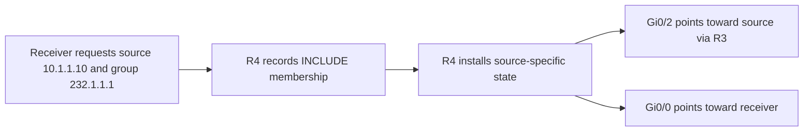

# IGMPv3 and SSM — identify the source as well as the group

**Objective:** move from a group-only receiver request to source-specific membership, then verify how that request appears in the multicast routing table.

## Two memberships on the same receiver LAN

| Group | Captured membership | Captured routing state |
|---|---|---|
| `239.1.1.1` | EXCLUDE; source list empty | Existing ASM membership remains after the version change |
| `232.1.1.1` | INCLUDE; SSM flag | `(10.1.1.10,232.1.1.1)`, flags `sTI` |

INCLUDE requests traffic from listed sources. EXCLUDE requests traffic from sources other than those listed; an empty EXCLUDE list expresses any-source interest. IGMPv3 reports use `224.0.0.22`. The report destination was covered conceptually; the retained evidence is CLI state.

## Configuration and result

R4's receiver interface changed to `ip igmp version 3`. The lab enabled `ip pim ssm default` and used `ip igmp join-group 232.1.1.1 source 10.1.1.10` on the simulated receiver. The default SSM range is `232.0.0.0/8`.

The resulting entry uses Gi0/2 with RPF neighbor `10.34.0.1` and forwards toward Gi0/0. Its flags are `s` (SSM group), `T` (SPT bit), and `I` (source-specific host report received). There is no `(*,232.1.1.1)` entry in the displayed result. The ASM RP can remain configured for other groups; SSM does not require an RP for this channel.

## Resolve conflicting-looking output

The IGMP detail view printed INCLUDE/SSM but no source row. The multicast route independently named `10.1.1.10` and carried the `I` flag. Both views are preserved. The cause of the missing displayed row was not established, so it is not labeled a confirmed software defect.

`show ip pim ssm` was rejected by this image. Reading the relevant running configuration and the resulting membership/route state provided usable verification.

## Engineering lessons

- Changing the IGMP version does not automatically change existing ASM membership into an SSM channel.
- Read the group, source, flags and interfaces together. No single display establishes the entire service outcome.
- A populated `(S,G)` can be created by receiver interest before live source traffic. It is not a substitute for a delivery test.

The completed exercise verifies source-specific control-plane state. Actual SSM delivery and rejection of a second source were not captured.

[Configuration](configs/README.md) · [Recorded evidence](verification/02-v3-ssm.md) · [Verification case](troubleshooting/02-ssm-verification.md) · [Overview](README.md)
