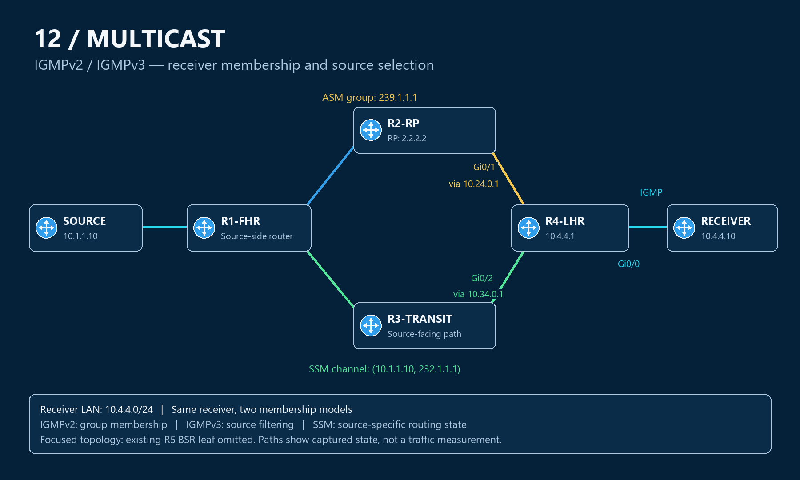

# IGMP topology — focus on the receiver edge

This is a focused view of the existing seven-node multicast lab. The work centers on R4's receiver LAN. The image highlights the two relevant routing directions; R5 remains outside the traffic path and is omitted from this focused drawing.

## Roles and addresses

| Element | Address or interface | Role in this exercise |
|---|---|---|
| MCAST-SOURCE | 10.1.1.10 | Source named in the SSM request |
| R1-FHR | Source LAN and links to R2/R3 | Existing first-hop router |
| R2-RP | Loopback0 2.2.2.2 | RP for the existing ASM group |
| R3-TRANSIT | 10.34.0.1 toward R4 | R4's source-facing RPF neighbor |
| R4-LHR | Gi0/0, 10.4.4.1/24 | IGMP querier and receiver-facing router |
| MCAST-RECEIVER | Gi0/0, 10.4.4.10/24 | Simulated receiver using IOS join-group commands |
| R5-BSR2 | Existing leaf off R3 | BSR lab context; not part of the SSM delivery path |

## Follow the relevant interfaces

| R4 interface | Neighbor/network | Captured role |
|---|---|---|
| Gi0/0 | Receiver LAN 10.4.4.0/24 | Membership reporting and outgoing receiver branch |
| Gi0/1 | R2 at 10.24.0.1 | RP-facing direction for `(*,239.1.1.1)` |
| Gi0/2 | R3 at 10.34.0.1 | Source-facing direction for `(10.1.1.10,232.1.1.1)` |

Gold highlights the ASM RP direction; green highlights the SSM source direction; cyan highlights the receiver LAN. These are interpretations of routing state, not packet traces. The source-specific entry was captured without a retained SSM delivery test.

[Complete inherited wiring](../PIM-SM/topology-bsr.md) · [IGMPv2](igmpv2.md) · [IGMPv3 and SSM](igmpv3-ssm.md) · [Overview](README.md)
