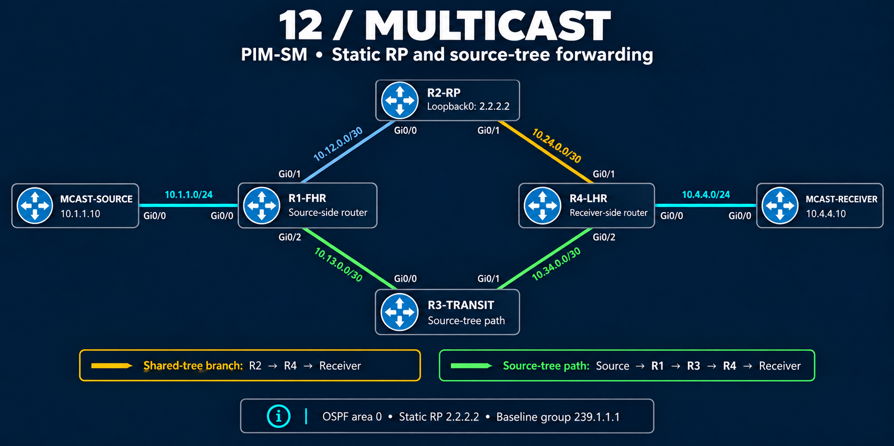

# PIM-SM — Discover the RP, trace the path, isolate the fault

Protocol Independent Multicast Sparse Mode (PIM-SM) builds delivery paths for receivers that request a multicast group. A Rendezvous Point (RP) gives sources and receivers a common meeting point; the network can then use a source-specific path.

I used a diamond-shaped topology to make those paths visibly different. The work progresses from a static RP to dynamic Auto-RP discovery, with controlled routing changes, RP faults and a listener-related recovery incident.

**6 IOSv nodes · 4 case studies · 69 evidence blocks**

**Status:** Static-RP and Auto-RP phases documented. BSR is next and has not been completed.

## Follow the two phases

| Phase | What it covers | Start here |
|---|---|---|
| Static RP | Receiver membership, source registration, different tree paths and three controlled exercises | [Baseline evidence](verification/01-baseline.md) and [original configuration guide](configs/README.md) |
| Auto-RP | Migration to dynamic discovery, removal of static fallback, listener troubleshooting and final forwarding | [Auto-RP overview and lessons](auto-rp.md) |

## Results at a glance

| Exercise | Recorded result | What it demonstrates |
|---|---|---|
| Receiver joins, then source sends | Receiver replies; R4's shared and source entries use different interfaces | Membership, tree state and delivery are separate checks |
| Change R4's route toward the source | Source tree moves from R3 to R2 and returns after rollback | Unicast routing affects multicast path selection |
| Remove R4's static RP mapping | Membership remains; restoring the mapping rebuilds the upstream tree | Local interest alone does not establish delivery |
| Remove R1's static RP mapping | Twenty probes time out; restoration brings back registration and source state | A receiver tree can coexist with a source-side fault |
| Replace static RP with Auto-RP | Dynamic-only mappings and 19 replies from 20 probes | Discovery works without static fallback |
| Restore Auto-RP control transport | R3 receives announcements again; R4 relearns the RP; native source-tree state returns | Role configuration and control-message transport must both work |

## Start with a case

- [Auto-RP roles exist, but discovery cannot recover](troubleshooting/04-autorp-listener-recovery.md) — distinguish initial outage conditions from a domain-wide listener problem during recovery.
- [A ready receiver with no replies](troubleshooting/03-source-rp-failure.md) — interpret source identity and receiver readiness during a static-RP fault.
- [Receiver membership without an upstream tree](troubleshooting/02-receiver-rp-failure.md) — compare the missing RP setting at the other edge.
- [A unicast route moves the multicast tree](troubleshooting/01-rpf-path-change.md) — follow the changed path across three routers.

## Lab design

The diagram shows the original baseline; physical links and addresses remain unchanged for Auto-RP.

| Device | Responsibility |
|---|---|
| MCAST-SOURCE | Sends multicast probes from 10.1.1.10 |
| R1-FHR | First-hop router beside the source |
| R2-RP | RP at Loopback0 2.2.2.2; Candidate RP in the Auto-RP phase |
| R3-TRANSIT | Baseline source-tree transit; Mapping Agent in the Auto-RP phase |
| R4-LHR | Last-hop router beside the receiver |
| MCAST-RECEIVER | Joins the group and replies from 10.4.4.10 |

OSPF area 0 supplies unicast reachability. R4 reaches the RP through R2 and the source through R3. Group `239.1.1.1` is the baseline throughout both phases. Temporary groups `239.2.2.2` and `239.3.3.3` belong to the original static-RP fault exercises.

[Addressing and wiring](topology.md) · [Auto-RP discovery roles](auto-rp.md#same-topology-separate-discovery-roles)

## Explore the files

| Location | What you will find |
|---|---|
| [Troubleshooting](troubleshooting/README.md) | Four cases linked to exact evidence blocks |
| [Verification](verification/README.md) | Seven evidence pages with phase-specific interpretations |
| [Configurations](configs/README.md) | Six reconstructed static-baseline files and links to both phases' changes |
| [Auto-RP](auto-rp.md) | Migration, control-plane behavior, final forwarding and lessons learned |
| [Progress](../progress.md) | Completed work and the next BSR checkpoint |

## Evidence scope

The original static-RP captures are from September 20–21, 2026. Auto-RP adds September 22–23 captures and selected excerpts from the completed handoff. The supplied outputs are distinct from reconstructed configuration commands and protocol interpretation.

The static receiver-side repair establishes tree recovery; the static source-side repair has a reported reply without a complete recovery ping. Auto-RP's **19/20** result is the migration test. Its later repair is supported by recovered counters, mapping and forwarding-state excerpts, without another complete post-fix ping transcript.

The device templates reconstruct the original static baseline. The Auto-RP guide describes the subsequent changes; no final Auto-RP running-config set is presented as an export or claimed to have been rerun during documentation.

[Back to Multicast](../README.md) · [Back to portfolio](../../README.md)
