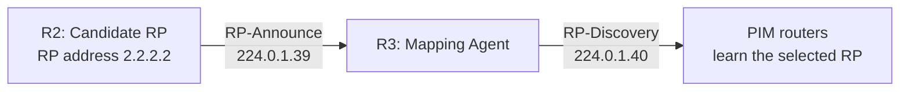

# Auto-RP — Migrate RP discovery and restore multicast delivery

Auto-RP lets routers learn the multicast Rendezvous Point (RP) dynamically instead of configuring its address on every router. The operational challenge is proving that discovery works throughout the network and continues to support the actual source-to-receiver path.

I migrated the working static-RP lab to Auto-RP, verified delivery without static fallback, and investigated a later discovery failure. The decisive finding was missing Auto-RP listener configuration across the sparse-mode domain. Restoring that transport behavior allowed the Mapping Agent to receive announcements again and the receiver-side router to relearn its RP.

**Completed Auto-RP phase · 30 evidence blocks**

Continue with the subsequent [BSR phase](bsr.md) for election resilience and RP-set distribution.

## Objective and results

| Checkpoint | Result |
|---|---|
| Dynamic discovery before removing static RP | R4 displayed an Auto-RP mapping to 2.2.2.2 alongside the existing static entry |
| Auto-RP-only operation | Static RP removed across R1–R4; source ping recorded 19 replies from 20 probes |
| Discovery recovery | R3 changed from no received announcements to Announce 0/5 and Discovery 10/0 after repair |
| Downstream RP learning | R4 learned 224.0.0.0/4 → 2.2.2.2 from 10.34.0.1, explicitly elected via Auto-RP |
| Final PIM-SM state | R4 used the source tree through R3; R2's source branch was pruned; R1 retained Gi0/2 for native forwarding |

[Migration and traffic result](verification/05-autorp-migration.md) · [Failure and recovery](verification/06-autorp-recovery.md) · [Final forwarding excerpts](verification/07-autorp-forwarding.md)

## Same topology, separate discovery roles

The [six-node wiring and addresses](topology.md) are unchanged. Source `10.1.1.10` sends to group `239.1.1.1`; receiver `10.4.4.10` joins that group.

| Router | Auto-RP role | Continuing forwarding role |
|---|---|---|
| R1-FHR | Learns the RP dynamically | First-hop router beside the source |
| R2-RP | Candidate RP, Loopback0 2.2.2.2 | Rendezvous Point |
| R3-TRANSIT | Mapping Agent | Transit router on the source-tree branch |
| R4-LHR | Learns the RP dynamically | Last-hop router beside the receiver |

The Candidate RP advertises its candidacy; the Mapping Agent distributes the selected group-to-RP mapping. In this sparse-mode-only lab, `ip pim autorp listener` supplies dense-mode forwarding treatment for the two Auto-RP control groups. It does not make a router a Mapping Agent or change the test group's ordinary sparse-mode forwarding.

## Migration from the working static baseline

The starting configuration was `ip pim rp-address 2.2.2.2` on all four routers.

1. Enable `ip pim autorp listener` across R1–R4.
2. Configure R2 with `ip pim send-rp-announce Loopback0 scope 16`.
3. Configure R3 with `ip pim send-rp-discovery scope 16`.
4. Verify announcements at R2, reception/distribution at R3, and discovery reception at R4.
5. Confirm the dynamic mapping points to the same RP before removing the static command from each router.
6. Verify Auto-RP-only mappings and retest multicast delivery.

The listener resolves the discovery dependency in this design: routers need RP information, while the mechanism distributing it itself uses multicast. The `scope 16` value is the control-message TTL, not the number of routers or a multicast address range.

R2 sent [three announcements](verification/05-autorp-migration.md#block-02); R3 progressed from zero counters to [one received announcement and two discoveries sent](verification/05-autorp-migration.md#block-04); R4 recorded [seven discoveries received](verification/05-autorp-migration.md#block-05).

R4's [coexistence capture](verification/05-autorp-migration.md#block-06) proves that Auto-RP was learning a mapping. The subsequent [R1](verification/05-autorp-migration.md#block-07), [R2](verification/05-autorp-migration.md#block-08), [R3](verification/05-autorp-migration.md#block-09) and [R4](verification/05-autorp-migration.md#block-10) displays contain no Static entry after the recorded removals. The [source ping](verification/05-autorp-migration.md#block-11) then records one timeout and nineteen replies from the receiver.

[Configuration, migration order and rollback](configs/auto-rp.md)

## Troubleshooting: roles were present, but discovery could not recover

During the later fault exercise, the Mapping Agent role was withdrawn. Investigation also exposed configuration drift: a static RP had reappeared on R4, and listener configuration was missing in the domain. After the static fallback was removed and R3's role restored, R3 still received no announcements.

The completed lab record identifies missing `ip pim autorp listener` configuration across R1–R4 as the cause of the persistent recovery failure. Restoring it throughout the domain allowed R3 to receive announcements and distribute the mapping again.

[Read Case 04 — Auto-RP roles exist, but control traffic cannot cross the domain](troubleshooting/04-autorp-listener-recovery.md). The case separates the intentional Mapping Agent withdrawal from the listener problem encountered during recovery.

## Forwarding after discovery recovers

Auto-RP changes how the RP is learned; the retained state then follows the same PIM-SM pattern as the static baseline.

| Stage | Evidence and interpretation |
|---|---|
| Receiver joins before source traffic | [R4 (*,G)](verification/07-autorp-forwarding.md#block-01) uses Gi0/1 toward RP neighbor 10.24.0.1 and Gi0/0 toward the receiver |
| Source becomes active | [J](verification/07-autorp-forwarding.md#block-02) is followed by [JT](verification/07-autorp-forwarding.md#block-03); the SPT bit is set and source traffic uses Gi0/2 through 10.34.0.1 |
| Neighbor correlation | [R4's PIM neighbors](verification/07-autorp-forwarding.md#block-04) match the RP-facing Gi0/1 and source-facing Gi0/2 directions |
| RP branch pruned for this source | [R2 keeps (*,G) but shows (S,G) as PT with Null OIL](verification/07-autorp-forwarding.md#block-06); group membership remains useful for other sources |
| Source registration settles | [R1 initially shows Registering and both branches](verification/07-autorp-forwarding.md#block-07); the [final entry](verification/07-autorp-forwarding.md#block-08) retains only Gi0/2 and no Registering label |

The final source path is **10.1.1.10 → R1 → R3 → R4 → 10.4.4.10**. R4 retains shared-tree state toward the RP while forwarding this source over the source-specific tree.

### Registration versus native forwarding

At startup, the first-hop router encapsulates original multicast data in a unicast PIM Register toward the RP. In normal PIM-SM operation, Register-Stop suppresses continued data registration once the relevant native forwarding conditions are met. Periodic registration checks can still occur.

The lab captured `Registering` and its later absence, along with the outgoing-branch change. That is **consistent with Register-Stop behavior**; no Register-Stop packet or debug message was supplied. The remaining `F` flag alone is not proof of continuous data encapsulation. The physical Gi0/1 branch disappearing and the registration label clearing are related observations, not the same event.

### Unicast routes still matter

`show ip route 239.1.1.1` returned [Network not in table](verification/07-autorp-forwarding.md#block-05). Group state belongs in `show ip mroute`. Unicast routes still determine the reverse paths toward the source and RP, which is why the two entries can select different interfaces.

## Engineering lessons learned

- Verify the full chain: Candidate-RP generation → Mapping-Agent reception → discovery distribution → downstream RP learning.
- Read Sent/Received counters in order and across time. An initial zero before the next advertisement is different from persistent zero reception during a failed recovery.
- Validate dynamic discovery before removing static configuration, then prove the static fallback is gone.
- Check listener configuration throughout a sparse-mode domain. Correct role commands on R2 and R3 do not prove control-message transport.
- Use `elected via Auto-RP` to establish mapping origin; the Mapping Agent's address is not the RP address.
- Keep membership, discovery and forwarding checks separate. Healthy IGMP can coexist with an absent RP mapping.
- Interpret source and shared-tree state together. A pruned source branch at the RP does not invalidate the retained group entry.
- Preserve phase context and configuration state between sessions. The cause of the missing or reappearing commands was not established in this lab.

## Evidence scope and study context

The 30 new blocks combine 20 retrieved CLI captures with 10 selected excerpts/field summaries supplied in the completed lab handoff. The **19/20** traffic result belongs to the Auto-RP-only migration test. Post-repair validation retains recovered counters, dynamic mapping and forwarding state; no separate complete post-repair ping transcript was supplied.

This lab develops the PIM-SM, source-registration, SPT, RPF and Auto-RP topics in Chapter 13 of the *ENCOR 350-401 Official Cert Guide, Second Edition*. The subsequent [BSR lab](bsr.md) extends this work with two candidates, propagation repair and RP selection testing.

[Back to PIM-SM](README.md) · [Back to Multicast](../README.md)

