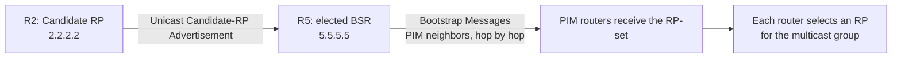

# BSR — Make RP discovery resilient and prove how it works

Multicast routers need a consistent way to find the Rendezvous Point (RP), where sources and receivers first meet. I replaced the previous discovery method with Bootstrap Router (BSR), added a second candidate for resilience, and tested which router took responsibility when priorities or connectivity changed.

The strongest troubleshooting result came when ordinary routing worked but RP discovery did not. I traced the gap to missing PIM settings on two R3 interfaces, restored participation, and verified that the routers learned the same RP. A final experiment used the device's hash output to explain an RP choice that contradicted the initial prediction.

**7 IOSv nodes · 3 additional case studies · 36 new evidence blocks · September 24–25, 2026**

[Start with the propagation case](troubleshooting/07-bsr-propagation.md) · [Browse the evidence](verification/README.md) · [Configuration guide](configs/bsr.md)

## Results at a glance

| Test | Recorded result | Engineering value |
|---|---|---|
| Remove prior discovery settings | R1–R4 filtered configuration is clean; R4's RP table is empty before BSR | Establish a fresh starting point instead of assuming the previous session's state |
| Add a higher-priority BSR candidate | R5 at priority 20 replaces R3 at 10 after the missing role command is corrected | Verify participation before diagnosing election behavior |
| Equalize BSR priorities | R5 remains elected when both candidates have priority 20 | Confirm the higher BSR address wins this tie |
| Isolate and reconnect R5 | R3 takes over in the connected domain; R3 accepts R5 again after recovery | Separate role recovery from traffic-continuity claims |
| Repair PIM propagation | R1–R4 learn RP 2.2.2.2 via bootstrap from R5 | Correlate underlay routes with multicast control-plane participation |
| Start source traffic | R4 installs the source tree through R3; R2 prunes that source branch | Verify forwarding state after discovery works |
| Add an equal-priority RP | R2's larger hash wins for 239.1.1.1; the temporary R3 RP role is then removed | Test the selection algorithm using group-specific evidence |

## Topology and roles

R5 adds a candidate to the BSR election without adding another source-to-receiver transit path. R2 remains the RP; R5 distributes the RP-set. These are separate responsibilities.

| Router | Address and BSR-phase role |
|---|---|
| R1-FHR | First-hop router for source 10.1.1.10 |
| R2-RP | Candidate RP at Loopback0 2.2.2.2; RP priority 0 |
| R3-TRANSIT | Candidate BSR at 3.3.3.3; BSR priority changes from 10 to 20; temporary second Candidate RP during selection testing |
| R4-LHR | Last-hop router for receiver 10.4.4.10 |
| R5-BSR2 | Candidate BSR at 5.5.5.5, priority 20; elected in the final connected state |

[Exact wiring and addressing](topology-bsr.md) · [Saved CML checkpoint and completion steps](configs/bsr.md#saved-checkpoint)

## How discovery reaches the routers

Candidate RPs first learn the elected BSR, then advertise to it by unicast. Regular IPv4 Bootstrap Messages use `224.0.0.13` and propagate through PIM neighbors with reverse-path checks toward the BSR. This mechanism does not require the Auto-RP listener used in the previous phase. The diagram describes protocol behavior; no BSR packet capture was retained.

The [recovery captures](verification/10-bsr-propagation.md#block-06) show the different viewpoints: R5 lists `Info source: 2.2.2.2`, while R1–R4 list `Info source: 5.5.5.5, via bootstrap`. The RP address is unchanged; the information arrived through different stages of distribution.

## Three investigations

- [R5 does not enter the election](troubleshooting/05-bsr-candidate-omission.md) — refreshing BSR timers led to checking whether the candidate command had actually been applied.
- [Isolate the preferred BSR, then restore it](troubleshooting/06-bsr-failover.md) — follow aging state, neighbor loss, takeover and the return of the preferred candidate.
- [OSPF reaches the BSR, but RP discovery stops](troubleshooting/07-bsr-propagation.md) — compare router-by-router BSR knowledge, the saved interface configuration and post-repair mappings.

## RP selection: the hash changes the answer

BSR election and RP selection use different rules. A larger **BSR priority** is preferred. For this IOSv RP-selection test, the best matching advertised group range is considered first, then the smaller **RP priority**, larger hash and finally larger RP address if the hash also ties.

With both RPs at priority 0, the initial prediction was that the larger address, 3.3.3.3, would win. R4's [group-specific hash output](verification/12-bsr-rp-selection.md#block-03) explained why that prediction failed:

| Candidate RP | Hash for 239.1.1.1, mask 0.0.0.0 | Result |
|---|---:|---|
| 2.2.2.2 | 1524600152 | Selected |
| 3.3.3.3 | 450145259 | Not selected |

The RP-set lists candidates; `show ip pim rp-hash 239.1.1.1` explains the choice for this group. The final [cleanup capture](verification/12-bsr-rp-selection.md#block-04) returns the set to R2 alone. The hash check was captured on R4; an equivalent R1 result was requested in the lab but not supplied.

## Forwarding after discovery

R4's [before-and-after state](verification/11-bsr-forwarding.md) separates receiver interest from the active source path:

| State | Incoming direction | Outgoing direction |
|---|---|---|
| R4 `(*,239.1.1.1)` | Gi0/1 toward RP R2, neighbor 10.24.0.1 | Gi0/0 toward the receiver |
| R4 `(10.1.1.10,239.1.1.1)` with `JT` | Gi0/2 toward R3, neighbor 10.34.0.1 | Gi0/0 toward the receiver |
| R2 source entry with `PT` | Gi0/0 toward R1 | Null; that source branch is pruned |

These entries support the source-tree path through R1 → R3 → R4, while group state remains rooted at R2. BSR changes RP discovery; normal PIM-SM tree behavior continues afterward.

## Lessons learned and evidence limits

- Confirm the candidate role exists before interpreting an election as faulty.
- Check PIM on each required interface. A valid OSPF route does not prove Bootstrap Message propagation.
- Validate the elected BSR, the RP-set and the chosen group RP separately.
- Keep BSR redundancy distinct from RP redundancy. The final lab has two BSR candidates but one Candidate RP.
- Use device output to resolve a failed prediction, including the hash stage of RP selection.

The BSR failure test occurred before Candidate RP setup. It proves election takeover and recovery, not uninterrupted multicast delivery or a measured failover time. Later captures establish recovered discovery and multicast forwarding state; no complete BSR multicast ping transcript was supplied. The earlier Auto-RP **19/20** result remains attributed to that phase.

[Back to PIM-SM](README.md) · [Back to Multicast](../README.md)
