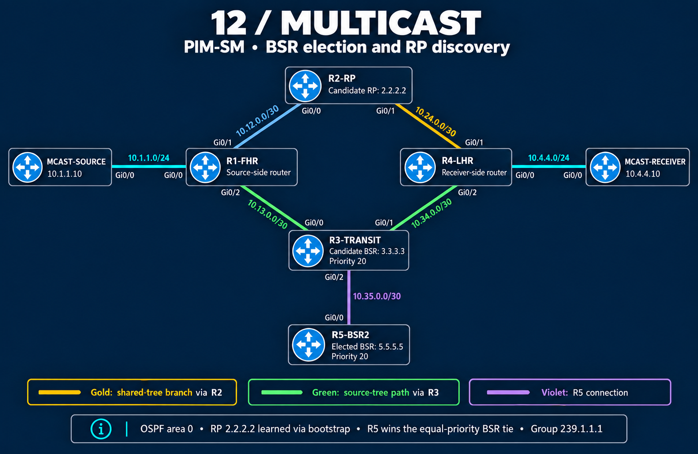

# BSR topology — add election resilience without changing the delivery path

The original six-node diamond gains **R5-BSR2**, connected only to R3. Seven IOSv nodes model five multicast routers and two endpoints. OSPF area 0 provides reachability; the test remains source `10.1.1.10`, group `239.1.1.1`, receiver `10.4.4.10`.

## Wiring

| Link | First endpoint | Second endpoint | Subnet |
|---|---|---|---|
| Source LAN | MCAST-SOURCE Gi0/0 — 10.1.1.10 | R1 Gi0/0 — 10.1.1.1 | 10.1.1.0/24 |
| R1–R2 | R1 Gi0/1 — 10.12.0.1 | R2 Gi0/0 — 10.12.0.2 | 10.12.0.0/30 |
| R1–R3 | R1 Gi0/2 — 10.13.0.1 | R3 Gi0/0 — 10.13.0.2 | 10.13.0.0/30 |
| R2–R4 | R2 Gi0/1 — 10.24.0.1 | R4 Gi0/1 — 10.24.0.2 | 10.24.0.0/30 |
| R3–R4 | R3 Gi0/1 — 10.34.0.1 | R4 Gi0/2 — 10.34.0.2 | 10.34.0.0/30 |
| Receiver LAN | R4 Gi0/0 — 10.4.4.1 | MCAST-RECEIVER Gi0/0 — 10.4.4.10 | 10.4.4.0/24 |
| New R3–R5 link | R3 Gi0/2 — 10.35.0.1 | R5 Gi0/0 — 10.35.0.2 | 10.35.0.0/30 |

Loopback0 supplies R2's RP address `2.2.2.2/32` and the candidate BSR addresses `3.3.3.3/32` on R3 and `5.5.5.5/32` on R5. Each is advertised into OSPF. R4 retains OSPF cost 2 on Gi0/1, which helps distinguish its RP-facing and source-facing paths.

## Read the diagram

Gold identifies the R2–R4 shared-tree branch; green identifies the R1–R3–R4 source-tree path. Cyan identifies the endpoint LANs. Violet marks the new physical connection to R5. These are physical links with role/path highlights, not a packet capture or a complete trace of every control message.

The image shows the **final connected roles**: R5 elected at BSR priority 20, R3 also a candidate at 20, and R2 the only Candidate RP. The equal BSR priority favors R5's larger address. R3's temporary Candidate RP role is limited to the [selection experiment](verification/12-bsr-rp-selection.md).

## Source and checkpoint

Wiring and interface addresses were checked against the [September 24 CML export](configs/PIM-SM_BSR_September_24th.yaml). That file predates the completed repair and Candidate RP setup. The diagram shows the completed intended roles; use the [completion commands](configs/bsr.md#complete-the-saved-checkpoint) when resuming from the export.

[Original static-RP topology](topology.md) · [BSR overview](bsr.md) · [Back to PIM-SM](README.md)
