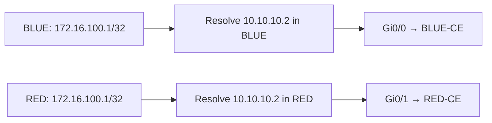

# VRF operation — an address needs a routing context

## Establish the boundary

R1 uses `vrf definition BLUE` and `vrf definition RED`, each with an IPv4 address family. `vrf forwarding` associates an interface with its VRF. On the captured IOSv image, applying that association removes the interface’s IPv4 address; the address must be reapplied before connected routes return.

The first binding tests used different BLUE and RED subnets. RED was then changed to the same 10.10.10.0/24 used by BLUE. This deliberate overlap makes the separation visible: both interfaces can use 10.10.10.1 because they belong to different routing contexts.

[Binding and connected-route evidence](verification/01-isolation.md)

## Follow one lookup through three layers

| Layer | BLUE | RED |
|---|---|---|
| Routing information base (RIB) | 10.10.10.0/24 connected on Gi0/0 | 10.10.10.0/24 connected on Gi0/1 |
| ARP neighbor 10.10.10.2 | 5254.0005.97a3 on Gi0/0 | 5254.0013.95df on Gi0/1 |
| CEF local 10.10.10.1 | Receive on Gi0/0 | Receive on Gi0/1 |
| CEF neighbor 10.10.10.2 | Attached on Gi0/0 | Attached on Gi0/1 |

The RIB chooses routes; Cisco Express Forwarding (CEF) uses forwarding and adjacency information to deliver packets. Here, VRF context remains significant through route lookup, ARP resolution and egress-interface selection.

## Reuse the remote prefix too

Both CEs host 172.16.100.1/32 on Loopback0. Each R1 VRF has the same static destination through the same next-hop IP, 10.10.10.2.

The [captured CEF recursion and ping tests](verification/02-identical-prefixes.md) establish both paths. The next exercises break the next hop and then the routing context to show why neither configuration nor route installation alone establishes successful forwarding.

[Troubleshooting cases](troubleshooting/README.md) · [Selective shared access](route-leaking/README.md) · [Overview](README.md)
