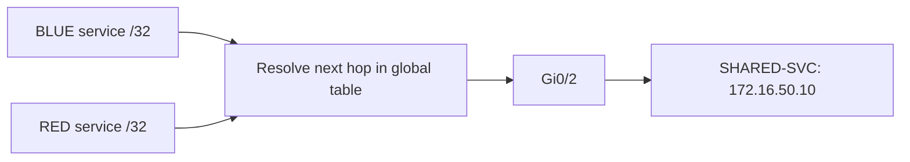
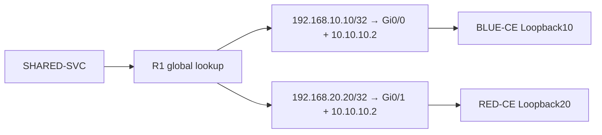

# Selective route leaking — two isolated networks, one shared service

The goal was to give BLUE and RED access to one service in the global table while retaining separate routing contexts. Unique CE loopbacks provided unambiguous destinations for testing the return direction.

## 1. Establish the boundary

SHARED-SVC uses 172.16.50.10/24 and a default route through R1 at 172.16.50.1. R1’s global ping succeeds, but neither VRF initially has a route to the service. [Blocks 18–19](../verification/04-forward-leak.md) retain the difference.

## 2. Install a selective forward route

On R1, the configuration is:

```ios
ip route vrf BLUE 172.16.50.10 255.255.255.255 172.16.50.10 global
ip route vrf RED 172.16.50.10 255.255.255.255 172.16.50.10 global
```

The destination route remains in the named VRF. **`global` specifies the context used to resolve the next hop.** Both installed routes show the next hop in `(default)` and CEF resolves through Gi0/2. The `/32` limits these entries to the shared-service address.



[Blocks 20–22 — parser, installation and remaining failure](../verification/04-forward-leak.md#block-20--check-the-parser-instead-of-assuming-support)

## 3. Make the return destinations unique

Both CEs already used identical transit and Loopback0 addresses. A single global lookup for the same overlapping endpoint would not identify which CE was intended. The exercise added distinct test loopbacks instead:

| Routing context | CE test endpoint | R1 VRF next hop |
|---|---|---|
| BLUE | Loopback10: 192.168.10.10/32 | 10.10.10.2 through Gi0/0 |
| RED | Loopback20: 192.168.20.20/32 | 10.10.10.2 through Gi0/1 |

R1 could reach each loopback in its VRF. SHARED-SVC could not: both probes returned `U.U.U`, and R1 lacked both destinations globally. [Blocks 24–26](../verification/05-return-path.md) should be read with [the service default-route capture](../verification/04-forward-leak.md#block-23--the-service-has-an-installed-default-route).

## 4. Complete both directions

R1’s global return routes specify both egress interface and next hop:

```ios
ip route 192.168.10.10 255.255.255.255 GigabitEthernet0/0 10.10.10.2
ip route 192.168.20.20 255.255.255.255 GigabitEthernet0/1 10.10.10.2
```

Both CEs also receive this service route:

```ios
ip route 172.16.50.10 255.255.255.255 10.10.10.1
```

The return commands are reconstructed from the lab sequence and corroborated by the captured RIB/CEF entries. Their cross-context behavior is an **observed IOSv result**; support and restrictions must be checked for another image or platform.



For the successful BLUE test, the request travels from SHARED-SVC to R1’s global table, then via Gi0/0 to BLUE-CE. The echo reply follows BLUE-CE’s service route to R1, enters BLUE, and uses BLUE’s globally resolved service route out Gi0/2. RED follows the corresponding Gi0/1 path. This path explanation is derived from the route/CEF evidence and successful exchanges, not a packet capture.

## 5. Validate the outcome

| Final probe from SHARED-SVC | Captured result |
|---|---|
| 192.168.10.10 | 100% — 5/5 replies |
| 192.168.20.20 | 100% — 5/5 replies |

[Blocks 27–29 — exact return routes, CE routes and final tests](../verification/05-return-path.md#block-27--explicit-egress-resolves-the-overlapping-next-hop)

Route leaking supplies selected reachability; it does not merge routing tables or add encryption. This exercise establishes bidirectional ICMP exchanges to two unique loopbacks, not general access to every overlapping address.

[Missing-return-path case](../troubleshooting/03-return-path.md) · [Later configuration additions](../configs/later-additions.md) · [VRF overview](../README.md)
