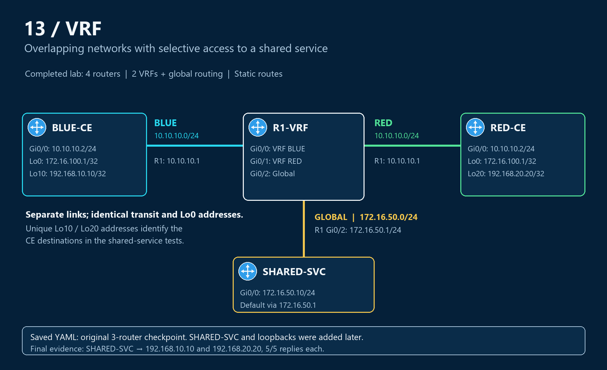

# Topology — overlapping CE networks and a shared global service

## Physical links

| Link | First endpoint | R1 endpoint | Routing context on R1 |
|---|---|---|---|
| BLUE CE | BLUE-CE Gi0/0 — 10.10.10.2/24 | Gi0/0 — 10.10.10.1/24 | BLUE |
| RED CE | RED-CE Gi0/0 — 10.10.10.2/24 | Gi0/1 — 10.10.10.1/24 | RED |
| Shared service | SHARED-SVC Gi0/0 — 172.16.50.10/24 | Gi0/2 — 172.16.50.1/24 | Global |

The two 10.10.10.0/24 links are separate segments. R1 distinguishes them through VRF membership and egress interface. The CE routers do not need local VRFs for this topology.

## Loopbacks added during the lab

| Device | Interface | Address | Purpose |
|---|---|---|---|
| BLUE-CE | Loopback0 | 172.16.100.1/32 | Deliberately duplicated remote prefix |
| RED-CE | Loopback0 | 172.16.100.1/32 | Same prefix reached through RED |
| BLUE-CE | Loopback10 | 192.168.10.10/32 | Unique endpoint for shared-service testing |
| RED-CE | Loopback20 | 192.168.20.20/32 | Unique endpoint for shared-service testing |

## Checkpoint versus completed topology

The original `CCNP_VRF_Sept_27th (1).yaml` contains BLUE-CE, R1-VRF and RED-CE only. Its links map BLUE Gi0/0 to R1 Gi0/0, and R1 Gi0/1 to RED Gi0/0. Image definition: `iosv-159-3-m3`.

The diagram shows the later four-router lab, including the service and loopbacks recorded in subsequent output. The added node and later routes are documented in the configuration guide; no final four-node CML export was supplied.

[Saved checkpoint and configurations](configs/README.md) · [Forwarding explanation](operation.md) · [Overview](README.md)
