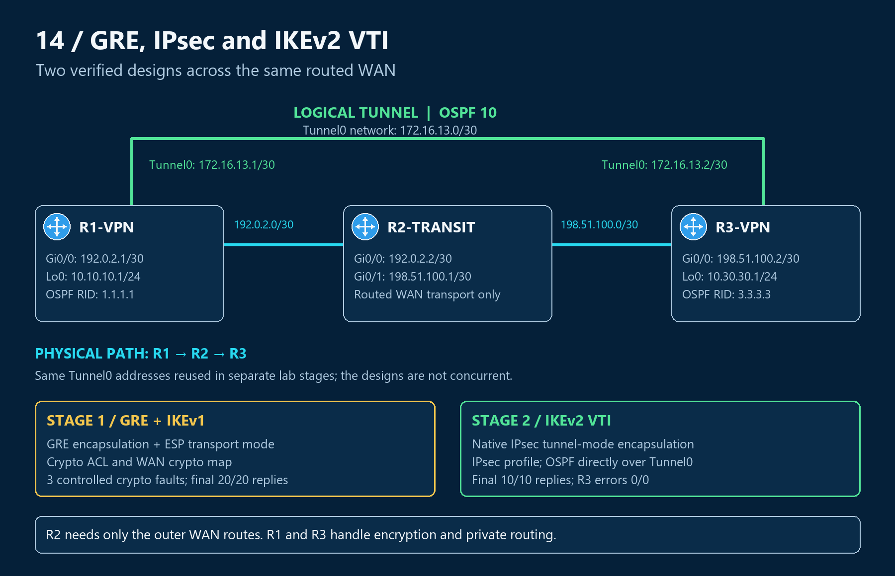

# 14 — GRE/IPsec and IKEv2 VTI: Two verified site-to-site designs

I built two VPN designs across the same three-router network to connect private endpoints through a transit router. The first combines GRE with policy-based IPsec; the second uses a route-based IPsec Virtual Tunnel Interface (VTI). Both carry OSPF and private traffic, with different ways of selecting and protecting that traffic.

The objective was to configure each design, verify routing and encrypted forwarding together, and explain what the device state establishes. Three controlled faults in the classic GRE/IKEv1 stage tested authentication, ESP negotiation, and traffic selection.

**GRE/IKEv1: 20/20 private replies after three fault repairs. IKEv2 VTI: 10/10 private replies, FULL OSPF, active ESP SAs, and zero final crypto errors.**

**Process diagrams:** [GRE packet flow](operation.md#how-private-traffic-crosses-the-transit-network) · [VTI packet flow](operation.md#how-the-vti-carries-private-traffic) · [IKEv2 configuration dependencies](configs/vti.md#how-the-objects-connect) · [Classic fault diagnosis](troubleshooting/README.md#locate-the-failing-layer)

## Topology and objective

R1-VPN and R3-VPN terminate the VPN. R2-TRANSIT routes only the WAN endpoints, 192.0.2.1 and 198.51.100.2. Tunnel0 uses 172.16.13.0/30; private loopbacks are 10.10.10.1 and 10.30.30.1. The two designs reuse these addresses in separate lab stages.

This project addresses **CCNP ENCOR 350-401 v1.2, objective 2.2.b — GRE and IPsec tunneling**, under configuring and verifying data path virtualization technologies.

[Addresses and wiring](topology.md) · [Encapsulation and forwarding](operation.md)

## Stage 1 — Classic GRE over IPsec with IKEv1

GRE supplied the routed overlay; a WAN crypto map protected the GRE packets with ESP transport mode. I established OSPF process 10 across Tunnel0, then deliberately mismatched the PSK, ESP transform, and traffic selector on R3.

Each repair restored protected forwarding and OSPF without a recorded routing-process restart. Final CLI combines **20/20 sourced replies**, **active inbound/outbound ESP**, **counter growth**, and **zero send/receive errors**.

[Classic configuration](configs/ipsec.md) · [Final CLI validation](verification/03-final-validation.md) · [Three troubleshooting cases](troubleshooting/README.md)

## Stage 2 — Route-based IPsec VTI with IKEv2

The VTI supplied the routed tunnel directly, without GRE. An IPsec profile applied tunnel-mode protection to Tunnel0; routing selected the packets entering it. OSPF process 10 ran directly over the VTI in area 0 and exchanged the loopback host routes.

The recorded validation includes **IKEv2 READY**, **5/5 tunnel-address replies**, **FULL adjacency**, and **10/10 loopback-to-loopback replies from R3 to R1**. R3's final counters were **44 encapsulated/encrypted** and **51 decapsulated/decrypted**, with **zero errors** and both ESP SAs **ACTIVE(ACTIVE)**.

[IKEv2/VTI configuration stages](configs/vti.md) · [VTI routing and validation](verification/07-vti.md) · [Sanitized CML export](configs/IKEv2-VTI-CML-sanitized.yaml)

## Compare the two lab designs

| Design choice | Classic GRE/IKEv1 | IKEv2 VTI |
|---|---|---|
| Tunnel encapsulation | GRE carries the inner packet | IPsec supplies tunnel encapsulation |
| IPsec mode | Transport | Tunnel |
| Traffic selection | Crypto ACL matches GRE between WAN endpoints | Routing selects Tunnel0; no site-prefix crypto ACL |
| Protection attachment | Crypto map on Gi0/0 | IPsec profile on Tunnel0 |
| OSPF | Across GRE | Directly across the VTI |

[Packet-flow comparison](operation.md#compare-encapsulation-and-traffic-selection)

## Configuration memory

**IKEv2:** Proposal → Policy → Keyring → IKEv2 Profile → Transform Set → IPsec Profile → VTI

**Classic GRE/IPsec:** Negotiate → Authenticate → Protect → Select → Bind → Apply → Verify

These workflows organize the configuration jobs; the [configuration guide](configs/vti.md) explains the actual object references.

## Key engineering takeaways

- Prove reachability to the outer VPN endpoint independently of the tunnel. R2 needs neither private routes nor overlay OSPF.
- Pair tunnel and IKE state with current ESP SAs, routing, and sourced traffic checks.
- GRE selectors and VTI routing select traffic differently. Broad VTI selectors do not send every route through the VPN.
- Compare inbound and outbound SPIs across peers; each direction has its own SA.
- Existing SAs can conceal a changed configuration, and historical counters can outlive current forwarding.
- Keep the two stages' evidence separate. VTI work stopped after successful configuration and verification; its later retention rebuild is planned work.

## Navigate the evidence

[Configurations](configs/README.md) · [Verification and commands](verification/README.md) · [Classic troubleshooting](troubleshooting/README.md) · [Source and measurement boundaries](scope.md)

The classic stage retains the supplied console captures. The VTI stage combines saved node configuration with the completed-lab validation handoff; reported runtime results are identified separately from verbatim CLI. Keys are sanitized.

[Back to portfolio](../README.md)
