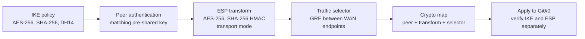

# IPsec configuration — protect GRE between the WAN endpoints

## How the configuration pieces connect



This is a configuration workflow. The crypto map directly binds the peer, transform set, and ACL; the IKE policy and peer key supply negotiation and authentication settings separately.

## Recorded settings

| Object | Lab setting | Engineering purpose |
|---|---|---|
| IKEv1 policy | AES-256; SHA-256; pre-shared key; DH14; lifetime 86400 seconds | Establish the authenticated IKE SA |
| Transform set GRE-IPSEC | ESP AES-256 and SHA-256 HMAC; transport mode | Protect GRE data traffic |
| GRE-IPSEC-ACL | GRE from the local WAN endpoint to the remote WAN endpoint | Select the encapsulated traffic for protection |
| GRE-IPSEC-MAP | Remote peer, GRE-IPSEC transform, GRE-IPSEC-ACL | Associate selection and protection with a peer |
| Interface application | Gi0/0 on both VPN routers | Activate the policy where outer packets leave |

The IKE policy values come from the handoff. The [final ESP output](../verification/02-ipsec.md) directly confirms the negotiated data transform and mode.

## Reciprocal traffic selectors

R1's reconstructed selector:

```ios
ip access-list extended GRE-IPSEC-ACL
 permit gre host 192.0.2.1 host 198.51.100.2
```

R3's reciprocal selector:

```ios
ip access-list extended GRE-IPSEC-ACL
 permit gre host 198.51.100.2 host 192.0.2.1
```

These ACLs select GRE, protocol 47, after tunnel encapsulation. The inner private source and destination are carried inside that GRE packet. Matching only the private subnets would select a different traffic identity from the design tested here.

## WAN application

The reconstructed R1 binding is:

```ios
crypto map GRE-IPSEC-MAP 10 ipsec-isakmp
 set peer 198.51.100.2
 set transform-set GRE-IPSEC
 match address GRE-IPSEC-ACL
!
interface GigabitEthernet0/0
 crypto map GRE-IPSEC-MAP
```

R3 uses peer 192.0.2.1. The capture confirms `interface: GigabitEthernet0/0` and crypto-map tag GRE-IPSEC-MAP. Tunnel0 supplies GRE and OSPF; the physical WAN interface applies this crypto-map policy.

IKE DH group 14 and IPsec PFS are separate settings. The final ESP capture reports **PFS N, DH group none**; the reconstruction therefore does not add `set pfs`.

[Complete endpoint extracts](README.md) · [Fault changes](faults.md) · [IPsec verification](../verification/02-ipsec.md) · [Overview](../README.md)
