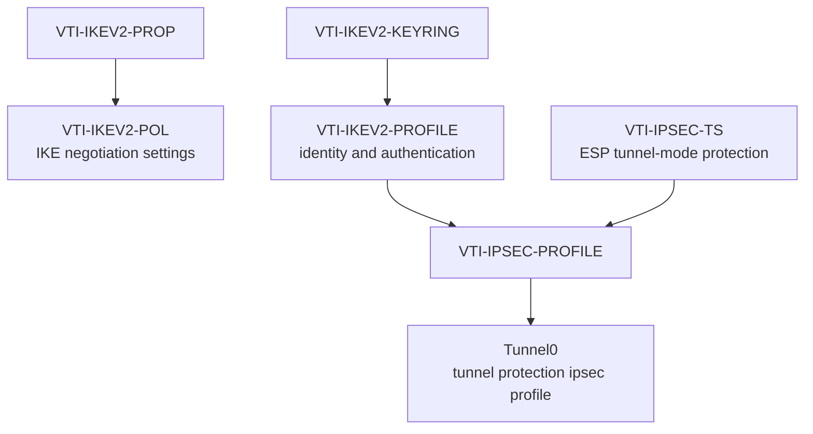

# IKEv2 VTI — build the object references, then the routed interface

The excerpts below come from the saved VTI node configurations. They are selected actual configuration, with the shared lab key sanitized. The [full relevant extracts](README.md#ikev2-vti) retain both endpoints.

## Configuration stages

| Stage | Saved object | Purpose |
|---|---|---|
| Proposal | VTI-IKEV2-PROP | IKE encryption, integrity, and DH settings |
| Policy | VTI-IKEV2-POL | Selects the proposal for IKE negotiation |
| Keyring | VTI-IKEV2-KEYRING | Holds the peer address and shared key |
| IKEv2 profile | VTI-IKEV2-PROFILE | Matches peer identity and defines local/remote authentication |
| Transform set | VTI-IPSEC-TS | Defines ESP encryption/integrity and tunnel mode |
| IPsec profile | VTI-IPSEC-PROFILE | References the transform set and IKEv2 profile |
| VTI | Tunnel0 | Supplies a routed interface with the IPsec profile attached |

## How the objects connect



The policy supplies the negotiated proposal. The IKEv2 profile references the keyring; the IPsec profile binds that authentication profile and the ESP transform. Tunnel0 attaches the IPsec profile. This shows configuration references, rather than a packet sequence.

## R1 negotiation and authentication

```ios
crypto ikev2 proposal VTI-IKEV2-PROP
 encryption aes-cbc-256
 integrity sha256
 group 14
!
crypto ikev2 policy VTI-IKEV2-POL
 proposal VTI-IKEV2-PROP
```

```ios
crypto ikev2 keyring VTI-IKEV2-KEYRING
 peer R3-VPN
  address 198.51.100.2
  pre-shared-key REPLACE_WITH_SHARED_VTI_LAB_KEY
 !
!
crypto ikev2 profile VTI-IKEV2-PROFILE
 match identity remote address 198.51.100.2 255.255.255.255
 identity local address 192.0.2.1
 authentication remote pre-share
 authentication local pre-share
 keyring local VTI-IKEV2-KEYRING
```

The saved proposal explicitly configures AES-CBC-256, SHA-256 integrity, and DH14. The handoff records negotiated PRF SHA256; no explicit PRF command appears in the saved proposal, so one has not been added to these excerpts. R3 uses the reciprocal identity/address and the same shared key.

## ESP protection and the VTI

```ios
crypto ipsec transform-set VTI-IPSEC-TS esp-aes 256 esp-sha256-hmac
 mode tunnel
!
crypto ipsec profile VTI-IPSEC-PROFILE
 set transform-set VTI-IPSEC-TS
 set ikev2-profile VTI-IKEV2-PROFILE
!
interface Tunnel0
 ip address 172.16.13.1 255.255.255.252
 tunnel source GigabitEthernet0/0
 tunnel mode ipsec ipv4
 tunnel destination 198.51.100.2
 tunnel protection ipsec profile VTI-IPSEC-PROFILE
```

R3 uses Tunnel0 172.16.13.2/30, source Gi0/0 at 198.51.100.2, and destination 192.0.2.1. IPsec tunnel mode supplies encapsulation directly. This stage uses no GRE interface mode, site-prefix crypto ACL, or WAN crypto map.

## Run OSPF directly over the VTI

R1's saved configuration:

```ios
router ospf 10
 router-id 1.1.1.1
 network 10.10.10.1 0.0.0.0 area 0
 network 172.16.13.0 0.0.0.3 area 0
```

R3's saved configuration:

```ios
router ospf 10
 router-id 3.3.3.3
 network 10.30.30.1 0.0.0.0 area 0
 network 172.16.13.0 0.0.0.3 area 0
```

The process advertises both loopback addresses and enables OSPF in area 0 across 172.16.13.0/30. The observed remote loopback routes are /32 advertisements, although the saved loopback interfaces use /24 masks.

## Configuration memory

**Proposal → Policy → Keyring → IKEv2 Profile → Transform Set → IPsec Profile → VTI**

For the classic design, retain **Negotiate → Authenticate → Protect → Select → Bind → Apply → Verify**. These are build workflows; the object references above explain how the saved VTI configuration fits together.

[VTI validation](../verification/07-vti.md) · [Classic IPsec guide](ipsec.md) · [Configurations](README.md) · [Overview](../README.md)
