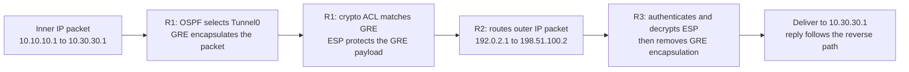

# Packet behavior — routing, encapsulation, and protection

## How private traffic crosses the transit network

The first routing decision selects Tunnel0 for the private destination. A separate underlay lookup reaches the remote WAN endpoint through R2. GRE's outer source and destination match the IPsec peers, allowing transport mode to protect the GRE header and carried packet while retaining the outer addressing.

R2 forwards the protected outer packet without learning either private loopback route. GRE also carries OSPF traffic across the overlay, so the transit router does not become an OSPF neighbor.

## Read the protocol layers

| Layer | Role in this lab |
|---|---|
| Inner IPv4 | Private traffic between 10.10.10.1 and 10.30.30.1, or routing traffic across Tunnel0 |
| GRE | Carries the overlay traffic; selected by IP protocol 47 in the crypto ACL |
| ESP transport mode | Encrypts/authenticates the GRE payload; the outer IPv4 packet uses protocol 50 when carried as native ESP |
| Outer IPv4 | WAN endpoints 192.0.2.1 and 198.51.100.2, routed through R2 |

This describes the configured native-ESP design. No packet capture is retained to inspect individual packets on R2.

## Negotiation state and forwarding state

IKEv1 Phase 1 authenticates the peers and establishes the IKE SA. Quick Mode negotiates the ESP protection and traffic identities. The two ESP directions have separate SAs and SPIs.

The [transform fault](troubleshooting/02-transform-mismatch.md) retained QM_IDLE while a new ESP SA could not form. The [selector fault](troubleshooting/03-selector-mismatch.md) produced the same broad IKE/ESP separation for a different cause. Compare the proposals and selected addresses to distinguish them.

## What the reported MTU establishes

The healthy IPsec output reports **plaintext MTU 1458** and **path/IP MTU 1500**. The plaintext figure is an IPsec SA field for the packet presented to IPsec, which already includes GRE encapsulation. It is not a measured 1458-byte inner-ping limit. GRE and ESP overhead, padding, and fragmentation all affect the usable inner packet size.

This project records the field without claiming a new DF boundary test or importing the old GRE-only size results.

[IPsec evidence](verification/02-ipsec.md) · [Final traffic validation](verification/03-final-validation.md) · [Overview](README.md)
