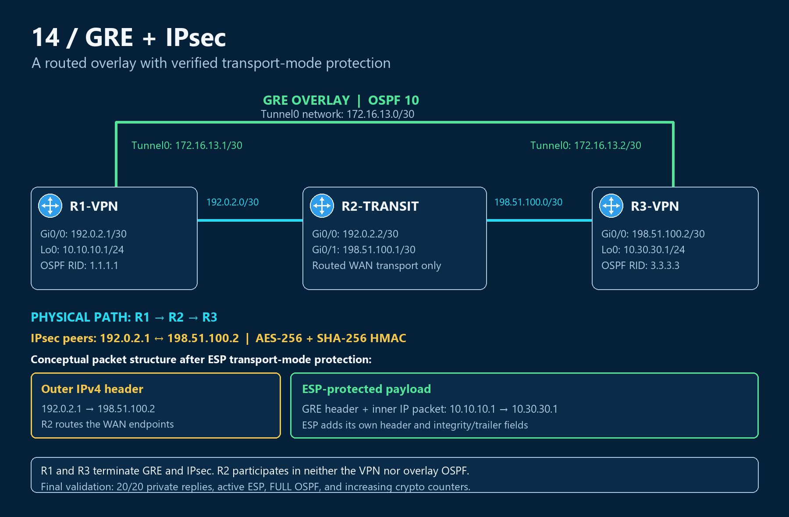

# Topology — two VPN endpoints and one routed transit router

## Device roles and addresses

| Device | Role | Interface | Address |
|---|---|---|---|
| R1-VPN | GRE/IPsec endpoint; OSPF RID 1.1.1.1 | Gi0/0 | 192.0.2.1/30 |
| R1-VPN | Private test endpoint | Loopback0 | 10.10.10.1/24 |
| R1-VPN | GRE overlay | Tunnel0 | 172.16.13.1/30 |
| R2-TRANSIT | Routed WAN transport | Gi0/0 | 192.0.2.2/30 |
| R2-TRANSIT | Routed WAN transport | Gi0/1 | 198.51.100.1/30 |
| R3-VPN | GRE/IPsec endpoint; OSPF RID 3.3.3.3 | Gi0/0 | 198.51.100.2/30 |
| R3-VPN | Private test endpoint | Loopback0 | 10.30.30.1/24 |
| R3-VPN | GRE overlay | Tunnel0 | 172.16.13.2/30 |

## Physical wiring and underlay routing

| Link | Endpoint A | Endpoint B | Subnet |
|---|---|---|---|
| R1–R2 | R1 Gi0/0 | R2 Gi0/0 | 192.0.2.0/30 |
| R2–R3 | R2 Gi0/1 | R3 Gi0/0 | 198.51.100.0/30 |

R1 reaches 198.51.100.2 through 192.0.2.2. R3 reaches 192.0.2.1 through 198.51.100.1. R2's connected networks provide the transit path; it has no GRE tunnel, OSPF overlay, or IPsec configuration.

## Logical overlay

Tunnel0 directly connects the VPN routers in 172.16.13.0/30. OSPF process 10 exchanges their loopback routes across this logical link. The configured loopbacks use /24 masks; their recorded OSPF advertisements are 10.10.10.1/32 and 10.30.30.1/32.

The elevated overlay line in the diagram represents a logical connection. Protected traffic still follows the physical R1–R2–R3 path. The packet sketch explains encapsulation and is not a packet capture.

[Configuration guide](configs/README.md) · [Packet flow](operation.md) · [Overview](README.md)
