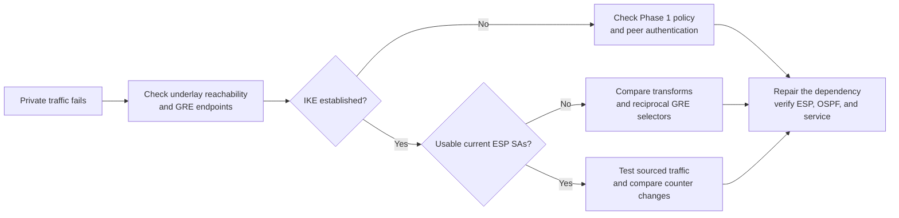

# Troubleshooting — locate the failing crypto dependency

These three exercises belong to the classic GRE/IKEv1 stage. VTI work is documented as successful configuration and verification in the [VTI guide](../verification/07-vti.md). Each exercise began from a working GRE/IPsec baseline. A single change on R3 tested whether I could separate negotiation state from protected forwarding and recover the service with a targeted repair.

| Case | Failure signature | Root cause | Retained recovery |
|---|---|---|---|
| [01 — PSK mismatch](01-psk-mismatch.md) | Main Mode attempts; no usable ESP; no OSPF neighbor | Peer authentication keys differed | QM_IDLE, nonzero SPI, counter activity, FULL OSPF |
| [02 — Transform mismatch](02-transform-mismatch.md) | QM_IDLE survives; ESP cannot rebuild; OSPF dead timer expires | R3 AES-128 disagreed with R1 AES-256 | New ESP SPI, 85/85 counters, zero errors, FULL OSPF |
| [03 — Selector mismatch](03-selector-mismatch.md) | QM_IDLE survives; wrong remote identity; historical counters mislead | R3 selected 192.0.2.5 instead of 192.0.2.1 | Reciprocal identity, new SPI, counters, FULL OSPF; final 20/20 test |

## Locate the failing layer

The diagram organizes investigation; it is not an exhaustive VPN diagnostic tree. In these controlled cases, the change and correction establish the cause. A state string alone does not uniquely identify a configuration fault.

## Two habits carried across the cases

Existing negotiated SAs initially masked the PSK and transform changes. Fresh negotiation exposed whether the new configuration could establish protection. Later, the selector case showed why cumulative counters need current SA state and fresh traffic alongside them.

[Numbered failure and recovery output](../verification/README.md) · [Reconstructed changes](../configs/faults.md) · [GRE/IPsec overview](../README.md)
