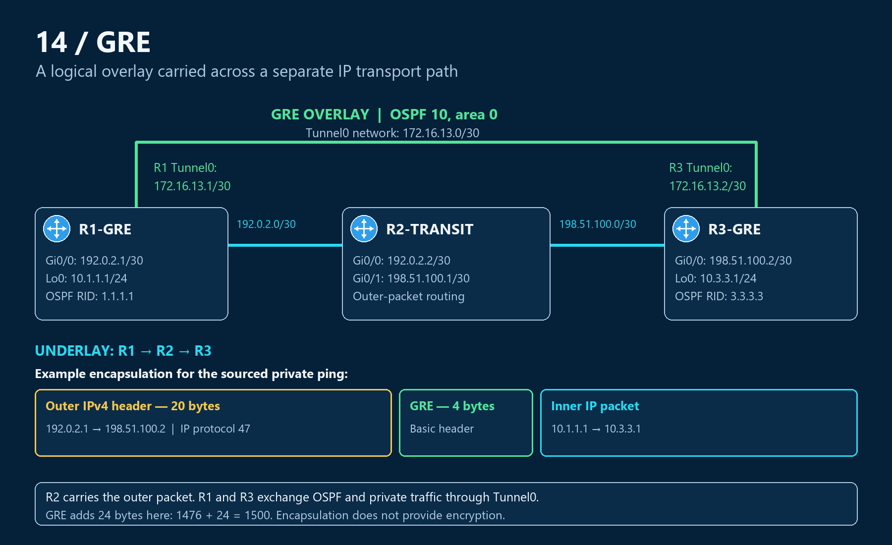

# 14 — GRE: An overlay with a working transport path

Generic Routing Encapsulation (GRE) carries traffic inside another IP packet so two routers can act as directly connected peers across an intermediate network. Engineers use it to build an overlay that can carry private traffic and routing protocols across a transport network. GRE provides encapsulation; encryption requires additional protection.

I built a three-router CML lab, formed OSPF across the tunnel, and verified private-to-private traffic. I then removed the transport route, introduced a recursive route, repaired both faults, and tested the packet-size boundary created by GRE overhead.

**3 routers · 1 GRE tunnel · 2 controlled routing faults · 12 evidence blocks**

## Results at a glance

| Test | What the evidence establishes | Recorded result |
|---|---|---|
| Transport endpoints | The actual tunnel source can reach its destination | 5/5 sourced underlay replies |
| GRE overlay | Tunnel parameters and peer forwarding agree | Up/up; 5/5 overlay replies |
| Routing and private traffic | OSPF operates across GRE and installs the remote loopback | FULL; metric 1001; 5/5 private-to-private replies |
| Missing transport route | Forwarding can fail before displayed state catches up | No RIB/CEF route; both probes 0/5; later up/down and neighbor loss |
| Recursive transport route | The tunnel destination cannot depend on its own tunnel | Explicit recursion syslogs; tunnel and OSPF recover after repair |
| MTU boundary | GRE overhead reduces the unfragmented packet size | 1476 with DF: 5/5; 1477 with DF: 0/5; 1477 without DF: 5/5 |

## Start with the evidence

Read [Case 02 — The transport route points through its own tunnel](troubleshooting/02-recursive-routing.md) for the strongest fault-to-recovery example. The syslogs identify a circular dependency that the later routing-table snapshot alone could miss.

For a quick successful-state review, follow [healthy verification](verification/01-baseline.md): transport reachability, GRE parameters, OSPF and the sourced private ping. The [MTU tests](verification/04-mtu.md) finish the lab with a controlled three-test comparison.

## Topology and objectives

**R1-GRE — R2-TRANSIT — R3-GRE** supplies the physical transport path. Tunnel0 directly joins R1 and R3 in the overlay, using 172.16.13.0/30. OSPF process 10 runs between the tunnel endpoints; R2 forwards outer IP packets without participating in the private overlay routing.

The objectives were to establish both transport directions, verify GRE and OSPF with traffic tests, diagnose dependency failures, and relate encapsulation overhead to observed packet delivery. This covers the GRE portion of ENCOR objective **2.2.b, GRE and IPsec tunneling**. IPsec is a separate portfolio stage.

[Addresses and wiring](topology.md) · [Configuration guide and CML export](configs/README.md) · [Packet-flow explanation](operation.md)

## Explore the files

| Guide | What to review |
|---|---|
| [Verification](verification/README.md) | Numbered outputs with concise interpretation and complete transcripts |
| [Troubleshooting](troubleshooting/README.md) | Missing transport route, recursive routing, and MTU diagnosis |
| [Configurations](configs/README.md) | Original three-node export, captured device configurations, and fault/repair commands |

## Lessons learned

- Prove reachability between the actual underlay source and destination before troubleshooting the overlay.
- Pair up/up and OSPF state with route, CEF and packet tests; displayed state can lag a forwarding failure.
- GRE uses IP protocol 47 and can carry OSPF, but supplies no encryption by itself.
- Keep the tunnel destination reachable through the underlay. A route through the tunnel itself creates a circular dependency.
- Compare historical syslogs with the current configuration and RIB; a safe covering route can appear after a recursive failure.
- Account for encapsulation overhead. The tested basic IPv4 GRE overhead was 24 bytes: 1476 + 24 fits 1500, while 1477 + 24 does not.

## Evidence scope

The September 27 CML export preserves the healthy three-router setup. Verification and controlled fault output were captured on September 30, 2026. The interface-state delay is observed IOSv behavior; the record does not establish a precise detection time. The MTU tests demonstrate the DF-dependent delivery boundary, without a retained fragment-level packet capture.

[Technical scope and source titles](scope.md) · [Back to portfolio](../README.md)
