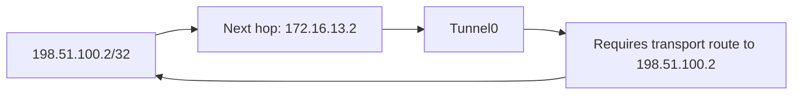

# Case 02 — The transport route points through its own tunnel

**Outcome:** removing the bad host route restored Tunnel0 up/up, OSPF FULL and the learned 10.3.3.1/32 route.

## Fault and symptoms

The healthy underlay /30 remained configured. R1 then received this more-specific route:

```ios
ip route 198.51.100.2 255.255.255.255 172.16.13.2
```

That route points the outer tunnel destination at the overlay peer. Reaching that peer requires Tunnel0, which itself requires reachability to the outer destination.



## Decisive evidence

The relevant syslogs identify the circular dependency and its consequences:

| Captured message | What it establishes |
|---|---|
| `%ADJ-5-PARENT` — looped chain attempting to stack | IOS detects a loop in the tunnel’s forwarding dependency |
| `%TUN-5-RECURDOWN` | Tunnel0 is temporarily disabled because of recursive routing |
| `%LINEPROTO-5-UPDOWN` | Tunnel0 line protocol changes to down |
| `%OSPF-5-ADJCHG` — FULL to DOWN, Interface down or detached | OSPF loses the adjacency as the interface dependency fails |

[Block 10 — exact command, route lookup and timestamped syslogs](../verification/03-recursion.md#block-10--correlate-the-bad-route-with-explicit-recursion-logs)

The destination lookup captured after the change displays the safe covering 198.51.100.0/30 through 192.0.2.2, rather than the unusable /32. That later snapshot does not erase the failure shown by the logs. The transcript does not retain every intermediate RIB state, so it does not establish precisely how long the /32 was active.

## Remediation and post-fix validation

Remove only the bad host route, preserving the healthy transport route:

```ios
no ip route 198.51.100.2 255.255.255.255 172.16.13.2
```

This repair command is reconstructed from the exercise instructions. [Block 11](../verification/03-recursion.md#block-11--remove-the-bad-32-and-verify-recovery) captures the subsequent up/up tunnel, FULL adjacency and OSPF route with metric 1001. The following MTU probes also confirm overlay packet delivery after recovery.

## Lesson learned

Keep transport-endpoint reachability independent of the overlay. A healthy covering route cannot prevent a more-specific misconfiguration from creating recursion. Correlate the current route, configured changes and historical syslogs before treating a current safe route as proof that no routing failure occurred.

[Next: MTU boundary](03-mtu-boundary.md) · [Fault command guide](../configs/faults.md) · [Case index](README.md)
